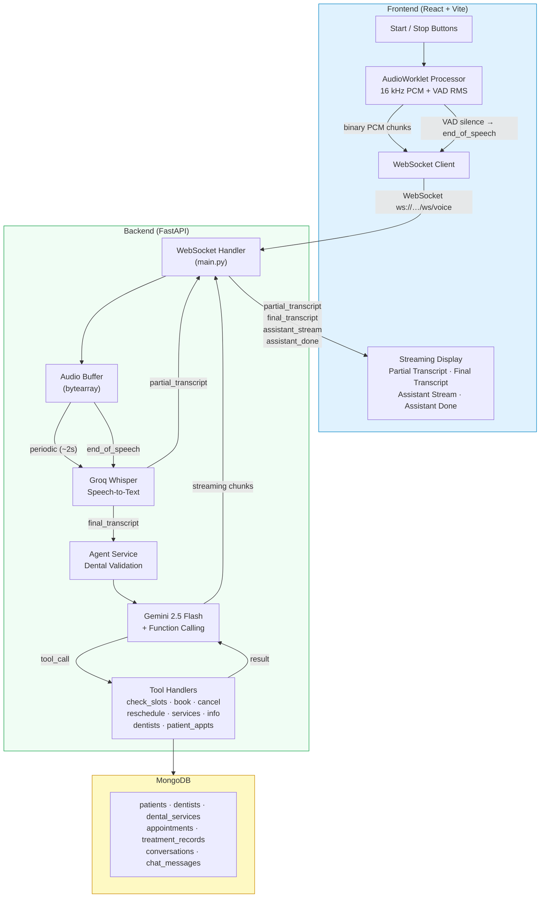
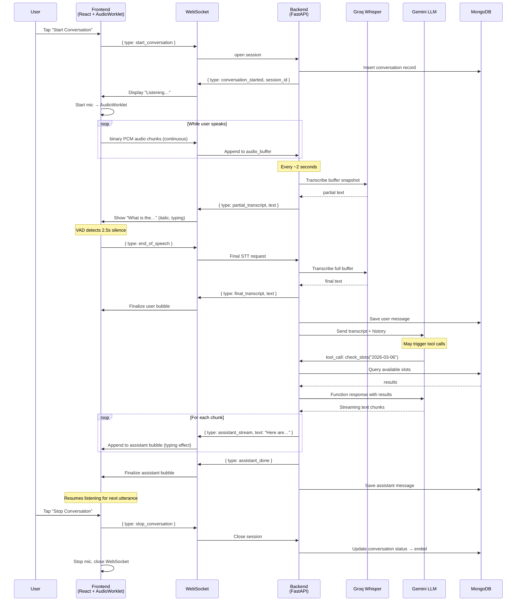
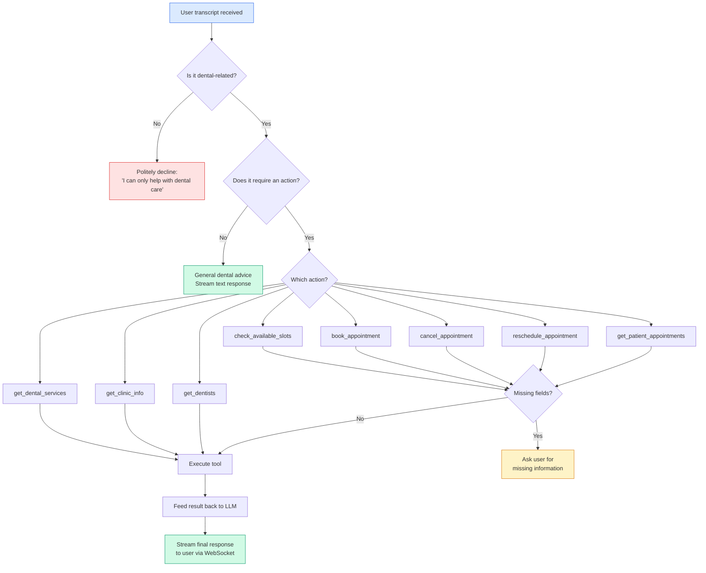
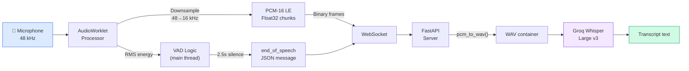
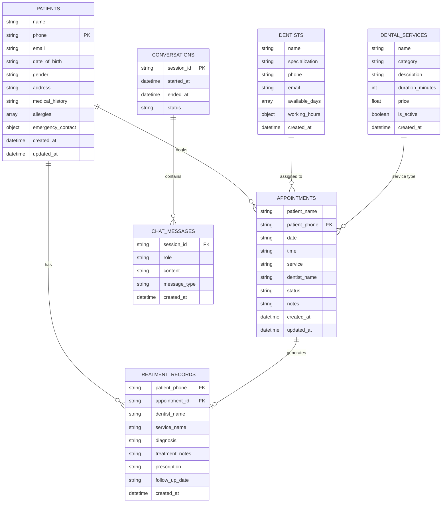

# SmileCare Dental Clinic – AI Voice Conversation System

## System Architecture (Mermaid)

### High-Level System Overview



### WebSocket Conversation Flow



### Agent Tool-Calling Decision Flow



### Audio Pipeline (AudioWorklet → STT)



### Database Entity Relationships



---

## System Architecture (ASCII)

```
┌──────────────────────────────────────────────────────────────────┐
│                        FRONTEND (React + Vite)                   │
│                                                                  │
│  ┌────────────┐   ┌──────────────────┐   ┌──────────────────┐   │
│  │  Start /    │   │  AudioWorklet    │   │  WebSocket       │   │
│  │  Stop Btns  │──>│  Processor       │──>│  Client          │   │
│  └────────────┘   │  (16kHz PCM)     │   │                  │   │
│                    │  + VAD (RMS)     │   │  ┌────────────┐  │   │
│                    └──────────────────┘   │  │ audio_chunk │──┼──>│ binary PCM
│                                           │  │ end_speech  │──┼──>│ JSON ctrl
│  ┌─────────────────────────────────────┐ │  └────────────┘  │   │
│  │  Streaming Display                   │ │                  │   │
│  │  - partial_transcript (italic)       │<┼──partial_txn     │   │
│  │  - final_transcript → chat bubble    │<┼──final_txn       │   │
│  │  - assistant_stream → typing effect  │<┼──asst_stream     │   │
│  │  - assistant_done → finalize bubble  │<┼──asst_done       │   │
│  └─────────────────────────────────────┘ └──────────────────┘   │
└──────────────────────────────────────────────────────────────────┘
                              │  WebSocket (ws://…/ws/voice)
                              ▼
┌──────────────────────────────────────────────────────────────────┐
│                     BACKEND (FastAPI + WebSocket)                 │
│                                                                  │
│  ┌──────────────┐   ┌──────────────────┐   ┌────────────────┐   │
│  │  WS Handler  │──>│  Audio Buffer    │──>│  Groq Whisper   │   │
│  │  (main.py)   │   │  (bytearray)     │   │  STT            │   │
│  └──────┬───────┘   └──────────────────┘   └───────┬────────┘   │
│         │                                           │            │
│         │  periodic (every ~2s)                     ▼            │
│         │  ──────────────────>  partial_transcript               │
│         │                                                        │
│         │  end_of_speech                                         │
│         │  ──────────────────>  final_transcript                 │
│         │                            │                           │
│         │                            ▼                           │
│         │                  ┌──────────────────┐                  │
│         │                  │  Agent Service    │                  │
│         │                  │  ┌────────────┐  │                  │
│         │                  │  │ Dental      │  │                  │
│         │                  │  │ Validation  │  │                  │
│         │                  │  └────────────┘  │                  │
│         │                  │  ┌────────────┐  │                  │
│         │                  │  │ Gemini LLM  │  │                  │
│         │                  │  │ + Tool Call  │  │                  │
│         │                  │  └─────┬──────┘  │                  │
│         │                  └────────┼─────────┘                  │
│         │                           │                            │
│         │                           ▼                            │
│         │                  ┌──────────────────┐                  │
│         │                  │  Tool Handlers    │                  │
│         │                  │  - check_slots    │                  │
│         │                  │  - book_appt      │                  │
│         │                  │  - cancel_appt    │                  │
│         │                  │  - reschedule     │                  │
│         │                  │  - get_services   │                  │
│         │                  │  - get_info       │                  │
│         │                  │  - get_dentists   │                  │
│         │                  │  - get_patient    │                  │
│         │                  └────────┬─────────┘                  │
│         │                           │                            │
│         │            streaming chunks│                            │
│         │<──── assistant_stream ─────┘                            │
│         │<──── assistant_done                                     │
│         │                                                        │
│         ▼                                                        │
│  ┌──────────────┐                                                │
│  │  MongoDB      │  Collections:                                  │
│  │               │  - patients                                    │
│  │               │  - dentists                                    │
│  │               │  - dental_services                             │
│  │               │  - appointments                                │
│  │               │  - treatment_records                           │
│  │               │  - conversations                               │
│  │               │  - chat_messages                                │
│  └──────────────┘                                                │
└──────────────────────────────────────────────────────────────────┘
```

---

## WebSocket Message Schema

### Client → Server

| Message | Format | Description |
|---------|--------|-------------|
| `start_conversation` | `{ "type": "start_conversation" }` | Opens a new session, mic starts automatically |
| `audio_chunk` | **Binary** (PCM-16 LE, 16 kHz, mono) | Raw audio from AudioWorklet, sent continuously |
| `end_of_speech` | `{ "type": "end_of_speech" }` | VAD detected 2–3 s silence → triggers final STT + LLM |
| `stop_conversation` | `{ "type": "stop_conversation" }` | Ends session, closes connection |

### Server → Client

| Message | Format | Description |
|---------|--------|-------------|
| `conversation_started` | `{ "type": "conversation_started", "session_id": "uuid" }` | Session initialized |
| `partial_transcript` | `{ "type": "partial_transcript", "text": "What is" }` | Interim STT result (every ~2 s) |
| `final_transcript` | `{ "type": "final_transcript", "text": "What is the weather" }` | Final STT after end-of-speech |
| `assistant_stream` | `{ "type": "assistant_stream", "text": "The weather" }` | Streamed LLM response chunk |
| `assistant_done` | `{ "type": "assistant_done" }` | LLM response complete |
| `error` | `{ "type": "error", "message": "..." }` | Error notification |

---

## Example Conversation Flow

```
1.  User taps [Start Conversation]
2.  Client → Server:  { "type": "start_conversation" }
3.  Server → Client:  { "type": "conversation_started", "session_id": "abc-123" }
4.  Mic starts, AudioWorklet captures 16 kHz PCM

5.  User says: "What appointments are available tomorrow?"
    Client → Server:  [binary PCM chunks streamed continuously]

    ~2 s later:
    Server → Client:  { "type": "partial_transcript", "text": "What appointments" }

6.  User stops speaking (2.5 s silence detected by VAD)
    Client → Server:  { "type": "end_of_speech" }

7.  Server → Client:  { "type": "final_transcript",
                         "text": "What appointments are available tomorrow?" }

8.  Server calls Gemini → tool call: check_available_slots("2026-03-06")
    → executes tool → feeds result back → streams final response

9.  Server → Client:  { "type": "assistant_stream", "text": "Here are the " }
    Server → Client:  { "type": "assistant_stream", "text": "available slots " }
    Server → Client:  { "type": "assistant_stream", "text": "for tomorrow..." }

10. Server → Client:  { "type": "assistant_done" }

11. System resumes listening for next utterance.

12. User taps [Stop Conversation]
    Client → Server:  { "type": "stop_conversation" }
    WebSocket closes, mic stops.
```

---

## Database Schema

### patients
| Field | Type | Description |
|-------|------|-------------|
| `name` | string | Patient full name |
| `phone` | string | Primary phone (unique index) |
| `email` | string | Email address |
| `date_of_birth` | string | YYYY-MM-DD |
| `gender` | string | Gender |
| `address` | string | Postal address |
| `medical_history` | string | Notes |
| `allergies` | string[] | Known allergies |
| `emergency_contact` | {name, phone} | Emergency contact |
| `created_at` | datetime | Record creation |
| `updated_at` | datetime | Last update |

### dentists
| Field | Type | Description |
|-------|------|-------------|
| `name` | string | Dr. full name |
| `specialization` | string | General, Orthodontics, Endodontics, etc. |
| `phone` | string | Contact |
| `email` | string | Email |
| `available_days` | string[] | ["Monday", "Tuesday", …] |
| `working_hours` | {start, end} | e.g. {"start":"09:00","end":"17:00"} |

### dental_services
| Field | Type | Description |
|-------|------|-------------|
| `name` | string | Service name |
| `category` | string | Preventive, Restorative, Cosmetic, Surgical, etc. |
| `description` | string | Human-friendly description |
| `duration_minutes` | int | Typical duration |
| `price` | float | Price in USD |
| `is_active` | bool | Currently offered |

### appointments
| Field | Type | Description |
|-------|------|-------------|
| `patient_name` | string | Name |
| `patient_phone` | string | Phone |
| `date` | string | YYYY-MM-DD |
| `time` | string | e.g. "10:00 AM" |
| `service` | string | Service name |
| `dentist_name` | string | Optional |
| `status` | string | scheduled / completed / cancelled / no_show |
| `notes` | string | Additional notes |

### conversations
| Field | Type | Description |
|-------|------|-------------|
| `session_id` | string | UUID (unique) |
| `started_at` | datetime | When started |
| `ended_at` | datetime | When ended |
| `status` | string | active / ended |

### chat_messages
| Field | Type | Description |
|-------|------|-------------|
| `session_id` | string | References conversation |
| `role` | string | user / assistant |
| `content` | string | Message text |
| `message_type` | string | text / audio_transcript |

---

## Silence Detection (VAD) Implementation

The frontend uses **energy-based Voice Activity Detection** in the AudioWorklet:

1. **AudioWorklet Processor** (`audio-processor.js`):
   - Receives 128-sample blocks from the microphone
   - Calculates **RMS** (root mean square) of each block
   - Posts `{ type: 'vad', rms }` to the main thread

2. **Main Thread VAD Logic** (`App.jsx`):
   ```
   if RMS > THRESHOLD (0.008):
       → user is speaking
       → reset silence timer
   else if was_speaking AND no silence timer:
       → start 2.5 s countdown
       → if silence persists → send end_of_speech
   ```

3. **Tunables**:
   - `VAD_SILENCE_THRESHOLD = 0.008` — RMS below this = silence
   - `VAD_SILENCE_TIMEOUT_MS = 2500` — 2.5 s silence = end of speech
   - `VAD_SPEECH_MIN_MS = 500` — ignore ultra-short speech bursts

---

## How to Run Locally

### Prerequisites
- Python 3.11+
- Node.js 18+
- MongoDB running locally (or a cloud URI)

### Environment Variables (`.env`)
```env
MONGO_URI=mongodb://localhost:27017
GOOGLE_API_KEY=your-gemini-api-key
GROQ_API_KEY=your-groq-api-key
ELEVEN_API_KEY=your-elevenlabs-api-key
```

### Backend
```bash
cd demo
python -m venv venv
source venv/Scripts/activate     # Windows
pip install -r requirements.txt
uvicorn app.main:app --reload --host 0.0.0.0 --port 8000
```

### Frontend
```bash
cd frontend
npm install
npm run dev
```

Open **http://localhost:5173** → click **Start Conversation** → speak.

---

## Tech Stack

| Layer | Technology |
|-------|-----------|
| Frontend | React 18, Vite, Tailwind CSS 4, AudioWorklet API |
| WebSocket | Native WebSocket (browser) ↔ FastAPI WebSocket |
| Backend | FastAPI (Python), asyncio |
| STT | Groq Whisper Large v3 |
| LLM | Google Gemini 2.5 Flash (with function calling) |
| TTS | ElevenLabs (fallback: gTTS) |
| Database | MongoDB (pymongo) |
| Voice capture | Web Audio API → AudioWorklet → PCM-16 @ 16 kHz |
