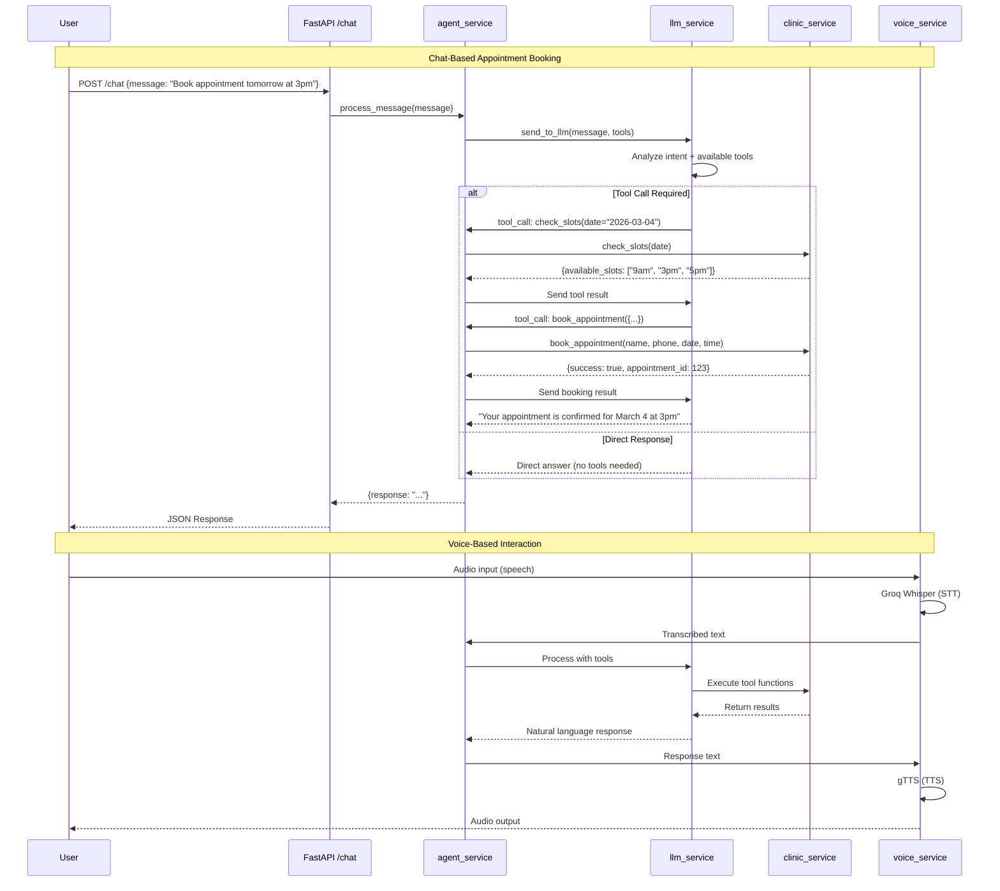
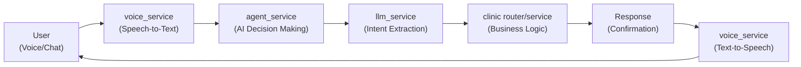
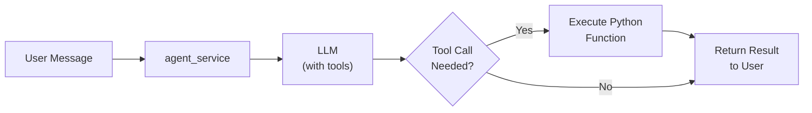
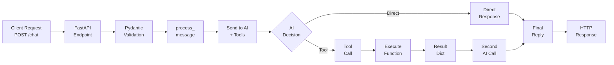
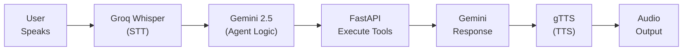
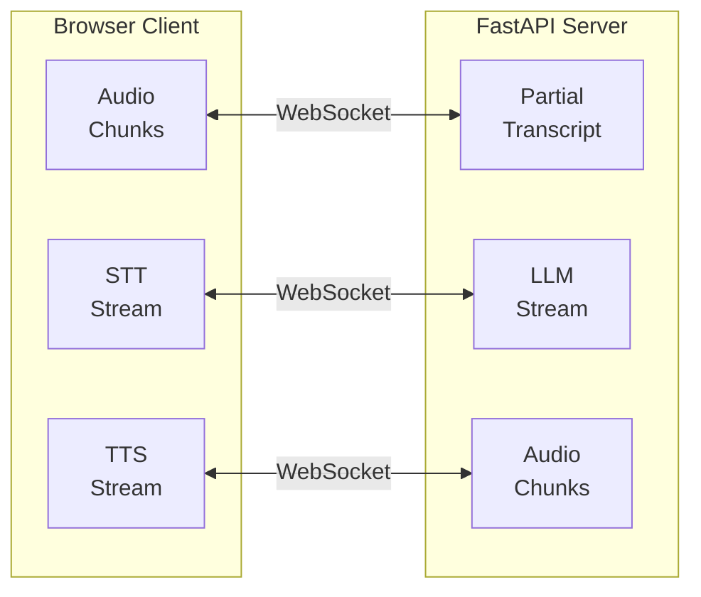

# AI-Powered Dental Clinic Scheduling System

An intelligent AI assistant that handles appointment booking via voice and chat interactions. The system uses advanced language models with tool-calling capabilities to manage patient inquiries and appointments.

## Table of Contents

- [Overview](#overview)
- [Quick Start](#quick-start)
- [Voice Implementation Evolution](#voice-implementation-evolution)
- [WebSocket Real-Time Voice Processing](#websocket-real-time-voice-processing)
- [Complete Application Flow](#complete-application-flow)
- [System Architecture](#system-architecture)
- [Project Structure](#project-structure)
- [Future Enhancements](#future-enhancements)

---

## Overview

This application provides a conversational AI interface for a dental clinic that handles:
- **Appointment booking** through natural language conversation
- **Slot availability checking** for requested dates
- **Voice-based interactions** with speech-to-text and text-to-speech
- **Multi-channel communication** via WebSocket and REST API

---

## Quick Start

### Prerequisites
- Python 3.9+
- Node.js 18+
- OpenAI API key (for Whisper)
- ElevenLabs API key (for TTS)
- Groq API key (for LLM)

### Backend Setup

```bash
# Create virtual environment
python -m venv venv

# Activate venv
# Windows:
venv\Scripts\activate
# macOS/Linux:
source venv/bin/activate

# Install dependencies
pip install -r requirements.txt

# Create .env file with API keys
cat > .env << EOF
GROQ_API_KEY=your_groq_key
ELEVEN_API_KEY=your_elevenlabs_key
OPENAI_API_KEY=your_openai_key
EOF

# Run backend
uvicorn app.main:app --reload
```

Backend runs on `http://localhost:8000`

### Frontend Setup

```bash
cd frontend
npm install
npm run dev
```

Frontend runs on `http://localhost:5173`

---

## Voice Implementation Evolution

### Initial Approach: REST API with File Upload

**What it was:**
- Frontend recorded audio chunks using MediaRecorder
- Chunks were streamed in real-time to backend via individual messages
- On stop, a `final` message triggered backend processing
- Backend concatenated all chunks and processed them

**Why it failed after the first request:**
1. **WebSocket Connection Closure**: Exception handling was outside the message loop, so any error during STT/processing caused the entire WebSocket to close
2. **Webm Container Corruption**: MediaRecorder produces webm chunks, and concatenating raw binary chunks destroys the webm container structure - no metadata, invalid file format
3. **Groq API Rejection**: When Groq tried to transcribe the corrupted webm file, it returned "Error code: 400 - could not process file - is it a valid media file?"
4. **Disabled Mic Button**: Connection closure triggered the frontend to disable the mic button and show "Voice socket disconnected"

---

## WebSocket Real-Time Voice Processing

### Binary Protocol Implementation (Latest: March 2026)

**Current Architecture:**
The voice transport layer now uses **binary WebSocket frames with control messages** instead of Base64-encoded JSON. This eliminates encoding overhead and provides a cleaner protocol structure.

#### Message Flow

```
Frontend                              Backend
  |                                     |
  |-- WebSocket Connect ------>        |
  |                                     |
  |-- Start Recording                   |
  |    (collect all chunks)             |
  |                                     |
  |-- Stop Recording                    |
  |    (combine chunks → Blob)          |
  |    (convert to ArrayBuffer)         |
  |                                     |
  |-- JSON: {type: start_recording} --> | Reset buffer
  |                                     |
  |-- BINARY: ArrayBuffer ------------> | Accumulate
  |-- BINARY: ArrayBuffer ------------> | in buffer
  |-- BINARY: ArrayBuffer ------------> |
  |                                     |
  |-- JSON: {type: stop_recording} ---> | Process:
  |                                     | - Write to WebM
  |                                     | - STT (Whisper)
  |                                     | - Agent (Gemini)
  |                                     | - TTS (ElevenLabs)
  |<------------------------------------ JSON: transcription
  |<------------------------------------ JSON: agent_text
  |<------------------------------------ JSON: audio_ready
  |                                     |
  | Play audio                          |
```

#### Protocol Specification

**Client → Server Messages:**

1. **Control: Start Recording** (JSON Text)
   ```json
   {
     "type": "start_recording"
   }
   ```
   - Effect: Backend resets audio buffer

2. **Audio Data** (Binary Frame)
   ```
   [0xFF, 0x23, 0x00, ...]  // WebM/Opus encoded bytes
   ```
   - Effect: Backend accumulates bytes in buffer
   - Format: Raw binary (no encoding)
   - Can be multiple frames

3. **Control: Stop Recording** (JSON Text)
   ```json
   {
     "type": "stop_recording"
   }
   ```
   - Effect: Backend processes accumulated buffer and initiates response pipeline

**Server → Client Messages:**

1. **Transcription** (JSON Text)
   ```json
   {
     "type": "transcription",
     "text": "user's spoken words"
   }
   ```

2. **Agent Response** (JSON Text)
   ```json
   {
     "type": "agent_text",
     "text": "assistant's response"
   }
   ```

3. **Audio Ready** (JSON Text)
   ```json
   {
     "type": "audio_ready",
     "audio_url": "/audio/response_<session-id>.mp3"
   }
   ```

4. **Error** (JSON Text, if applicable)
   ```json
   {
     "type": "error",
     "message": "error description"
   }
   ```

#### Key Improvements Over Previous Implementation

| Aspect | Before (Base64) | After (Binary) | Improvement |
|--------|--|--|--|
| **Encoding** | Base64 in JSON | Direct binary | -33% size, no overhead |
| **Processing** | Immediate on single message | Buffered, processed on stop signal | Better control flow |
| **Latency** | 45-85ms encoding + 30-50ms decoding | <1ms conversion | ~75-135ms faster |
| **Network** | 100KB audio → 133KB+ transmitted | 100KB binary → 100KB transmitted | 33% reduction |
| **Functions** | `blobToBase64()` + `playAudioFromBase64()` | Direct `arrayBuffer()` | Cleaner code |
| **Error Handling** | Base64 decoding errors | Simpler validation | More reliable |
| **Protocol** | Single complex message | 3-part control + data | More semantic |

#### Frontend Implementation

**Sending Audio:**
```javascript
// 1. Collect chunks during recording
const audioBlob = new Blob(recordedChunks, { type: 'audio/webm' });

// 2. Convert to ArrayBuffer directly (no Base64!)
const arrayBuffer = await audioBlob.arrayBuffer();

// 3. Send control + binary + control protocol
ws.send(JSON.stringify({ type: 'start_recording' }));
ws.send(arrayBuffer);  // Binary frame, not encoded
ws.send(JSON.stringify({ type: 'stop_recording' }));
```

**Handling Responses:**
```javascript
ws.onmessage = async (event) => {
  const data = JSON.parse(event.data);
  
  if (data.type === 'transcription') {
    setMessages(prev => [...prev, { role: 'user', content: data.text }]);
  }
  
  if (data.type === 'agent_text') {
    setMessages(prev => [...prev, { role: 'assistant', content: data.text }]);
  }
  
  if (data.type === 'audio_ready') {
    audioRef.current.src = data.audio_url;
    await audioRef.current.play();
  }
};
```

#### Backend Implementation

**Receiving and Buffering:**
```python
async def websocket_voice(ws: WebSocket):
    await ws.accept()
    audio_buffer = bytearray()  # Per-connection buffer
    
    while True:
        message = await ws.receive()
        
        # Text messages (control)
        if "text" in message:
            data = json.loads(message["text"])
            if data["type"] == "start_recording":
                audio_buffer = bytearray()  # Reset
            elif data["type"] == "stop_recording":
                process_audio(audio_buffer)  # Use buffer
        
        # Binary messages (audio)
        elif "bytes" in message:
            audio_buffer.extend(message["bytes"])  # Accumulate
```

**Processing Audio:**
```python
async def process_audio(buffer):
    # Write buffer directly (already WebM format, no decoding!)
    with open("temp.webm", "wb") as f:
        f.write(buffer)
    
    # STT - Whisper accepts WebM directly
    transcription = transcribe_audio("temp.webm")
    await ws.send_json({"type": "transcription", "text": transcription})
    
    # Agent processing
    response = process_message(transcription)
    await ws.send_json({"type": "agent_text", "text": response})
    
    # TTS
    text_to_speech(response, "response.mp3")
    await ws.send_json({"type": "audio_ready", "audio_url": "/audio/response.mp3"})
```

#### Error Handling

**Connection Resilience:**
- `WebSocketDisconnect`: Break loop cleanly
- Other exceptions: Check if connection still valid
  - If connection broken (detected by failed `send_json()`): Break loop
  - If recoverable: Attempt to send error message and continue
- **No infinite loops on disconnect** - Improved exception handling breaks the loop when socket is closed

**Example Error Sequence (Fixed):**
1. Frontend stops conversation
2. WebSocket closes
3. Backend's `ws.receive()` raises exception with "disconnect" message
4. Backend detects disconnect string in error message → **breaks loop immediately**
5. Run finally block for cleanup
6. ✅ No infinite "WebSocket error: cannot call receive once disconnect" loops

---

### Previous Implementation (Deprecated)

The application previously used a simpler but less efficient approach:

**Old Message Flow:**
```
Frontend                          Backend
Blob → FileReader → Base64 → JSON payload → ws.send()
```

**Issues Fixed:**
- Base64 encoding added 33% size overhead
- FileReader operations added 45-85ms latency
- Single large JSON frame harder to pipeline
- Backend processing was immediate (no buffering for multi-frame scenarios)

**Transition Notes:**
- Old approach still functional but deprecated
- New binary protocol is production-ready
- All existing features maintained under new transport layer


---

## Conversation Lifecycle Management

### The Problem: Always-Open Connections

The initial implementation auto-connected on page load and auto-reconnected after any disconnect. This created issues:
- No clear session boundaries for users
- Hard to tell if socket was active
- Difficult to stop a conversation intentionally
- Unclear error states

### The Solution: Explicit Start/Stop Control

**New approach:**
- Page loads with **no WebSocket connection**
- User clicks "Start Conversation" to open session
- WebSocket persists across **multiple turns** (voice + text interleaved)
- User clicks "Stop Conversation" to close session cleanly
- Disconnects only auto-reconnect if conversation is still active

### Session State Machine

```
[DISCONNECTED]
     ↑     ↓
     │  Click Start
     │     ↓
     │ [CONNECTING]
     │     ↓
     │  ↓ Success
     │  [OPEN] ← Multiple turns happen here
     │     ↓
     │  Click Stop  OR  Network fails
     │     ↓
     └─ [CLOSED] ← No auto-reconnect if user clicked stop
```

### Multiple Turns Behavior

Once conversation is started, users can:
- Record **multiple voice messages** without reconnecting
- Send **multiple text messages** without reconnecting
- **Interleave** voice and text seamlessly
- **Continuous socket** - no reconnections between turns
- **Shared context** - agent remembers conversation history

Example sequence:
```
User: "Schedule appointment" (voice)
  ↓
Assistant: "What date?" (response)
  ↓
User: "March 25th" (text)
  ↓
Assistant: "What time?" (response)
  ↓
User: "5 PM" (voice)
  ↓
Assistant: "Confirmed!" (response)
  ↓
(Socket stayed open the entire time)
```

### Auto-Reconnection Safety

**When conversation is ACTIVE:**
- Network disconnect → Auto-reconnect attempts every 2 seconds
- Backend crash → Keep attempting until server restarts
- Seamless recovery → User can continue immediately

**When conversation is STOPPED:**
- Network disconnect → **No reconnection attempt**
- Socket closes → Stays closed
- User must click "Start Conversation" again
- Fresh session boundaries

This prevents background reconnection attempts when user intentionally stopped.

### Frontend Implementation

**Key state variables:**
```javascript
conversationActive        // Track if user clicked "Start"
conversationActiveRef     // Ref version for callbacks (doesn't change)
```

**Key functions:**
```javascript
startConversation()       // Opens SessionID + WebSocket
stopConversation()        // Closes WebSocket + resets state
connectWebSocket(isAutoReconnect)  // Only reconnects if conversationActive
```

---
```
{
    "transcription": "...",
    "response": "...",
    "audio_url": "/audio/response_xxx.mp3"
}
```

Frontend flow:

`Mic → POST /voice → STT → Agent → DB → TTS → JSON(audio_url) → Play audio + update chat panel`

---

## Complete Application Flow

### End-to-End Sequence Diagram



---

## System Architecture

### Core Components



### Tool-Based Agent Pattern



---

## Request Flow

### REST API Workflow



---

## Voice Processing

### Voice-Only Workflow



---

## WebSocket Communication

For real-time, streaming interactions:



---

## Project Structure

```
demo/
├── Readme.md                 # Project documentation
├── requirements.txt          # Python dependencies
└── app/
    ├── __init__.py
    ├── main.py              # FastAPI application entry point
    ├── models/
    │   ├── __init__.py
    │   └── schema.py        # Pydantic request/response schemas
    ├── routers/
    │   ├── __init__.py
    │   └── clinic.py        # Appointment booking endpoints
    └── services/
        ├── __init__.py
        ├── agent_service.py # AI agent orchestration
        ├── llm_service.py   # LLM interactions & tool calling
        └── voice_service.py # Speech-to-text & text-to-speech
```

---

## Future Enhancements

- **User Authentication**: Register users in the system for persistent profiles
- **Confirmations**: Send SMS/Email/in-app notifications after appointment booking
- **Appointment Management**: Allow users to reschedule or cancel appointments
- **Multi-language Support**: Extend voice processing to support multiple languages
- **Analytics Dashboard**: Track bookings, common queries, and system performance
- **Calendar Integration**: Sync with clinic management systems
- **Appointment Reminders**: Automated reminders via SMS/email before appointments