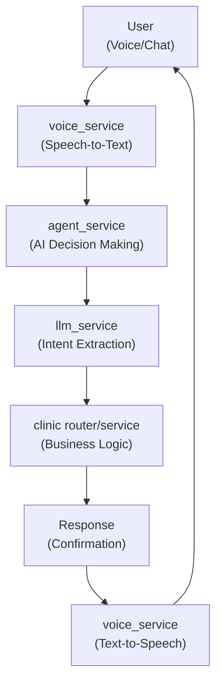
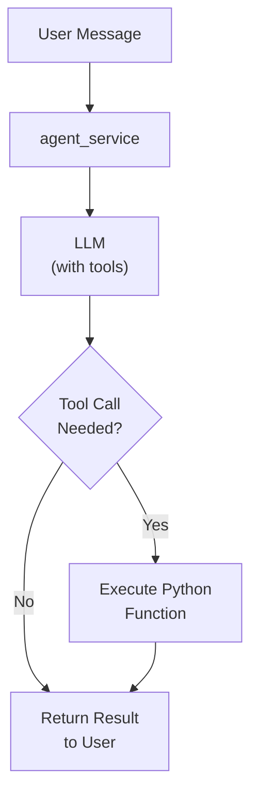
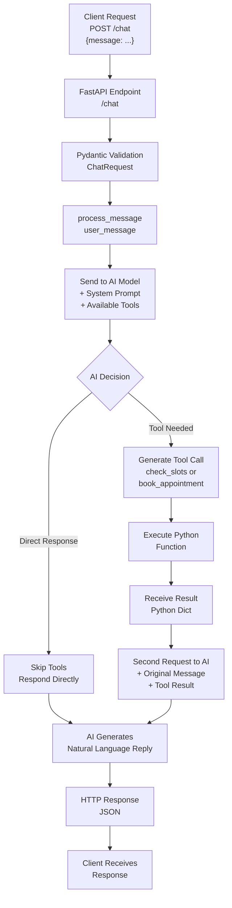
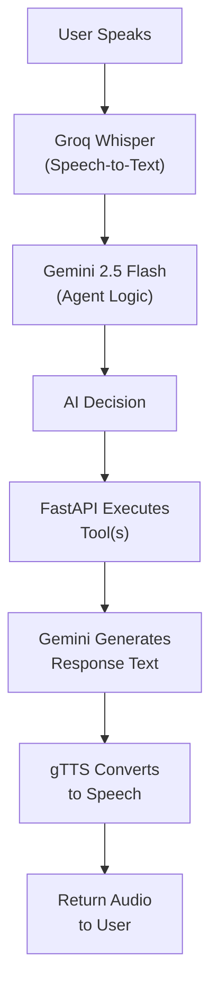
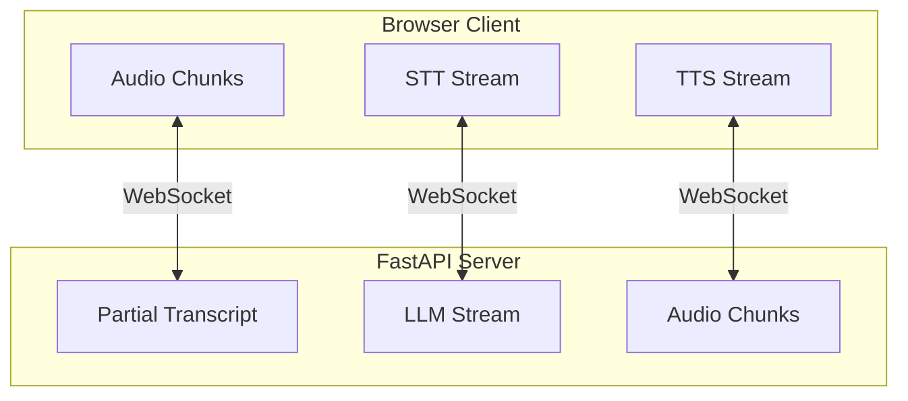

# AI-Powered Dental Clinic Scheduling System

An intelligent AI assistant that handles appointment booking via voice and chat interactions. The system uses advanced language models with tool-calling capabilities to manage patient inquiries and appointments.

## Table of Contents

- [Overview](#overview)
- [System Architecture](#system-architecture)
- [Request Flow](#request-flow)
- [Voice Processing](#voice-processing)
- [WebSocket Communication](#websocket-communication)
- [Project Structure](#project-structure)
- [Future Enhancements](#future-enhancements)

---

## Overview

This application provides a conversational AI interface for a dental clinic that handles:
- **Appointment booking** through natural language conversation
- **Slot availability checking** for requested dates
- **Voice-based interactions** with speech-to-text and text-to-speech
- **Multi-channel communication** via REST API and WebSocket

---

## System Architecture

### Core Components



### Tool-Based Agent Pattern



---

## Request Flow

### REST API Workflow



---

## Voice Processing

### Voice-Only Workflow



---

## WebSocket Communication

For real-time, streaming interactions:



---

## Project Structure

```
demo/
├── Readme.md                 # Project documentation
├── requirements.txt          # Python dependencies
└── app/
    ├── __init__.py
    ├── main.py              # FastAPI application entry point
    ├── models/
    │   ├── __init__.py
    │   └── schema.py        # Pydantic request/response schemas
    ├── routers/
    │   ├── __init__.py
    │   └── clinic.py        # Appointment booking endpoints
    └── services/
        ├── __init__.py
        ├── agent_service.py # AI agent orchestration
        ├── llm_service.py   # LLM interactions & tool calling
        └── voice_service.py # Speech-to-text & text-to-speech
```

---

## Future Enhancements

- **User Authentication**: Register users in the system for persistent profiles
- **Confirmations**: Send SMS/Email/in-app notifications after appointment booking
- **Appointment Management**: Allow users to reschedule or cancel appointments
- **Multi-language Support**: Extend voice processing to support multiple languages
- **Analytics Dashboard**: Track bookings, common queries, and system performance
- **Calendar Integration**: Sync with clinic management systems
- **Appointment Reminders**: Automated reminders via SMS/email before appointments