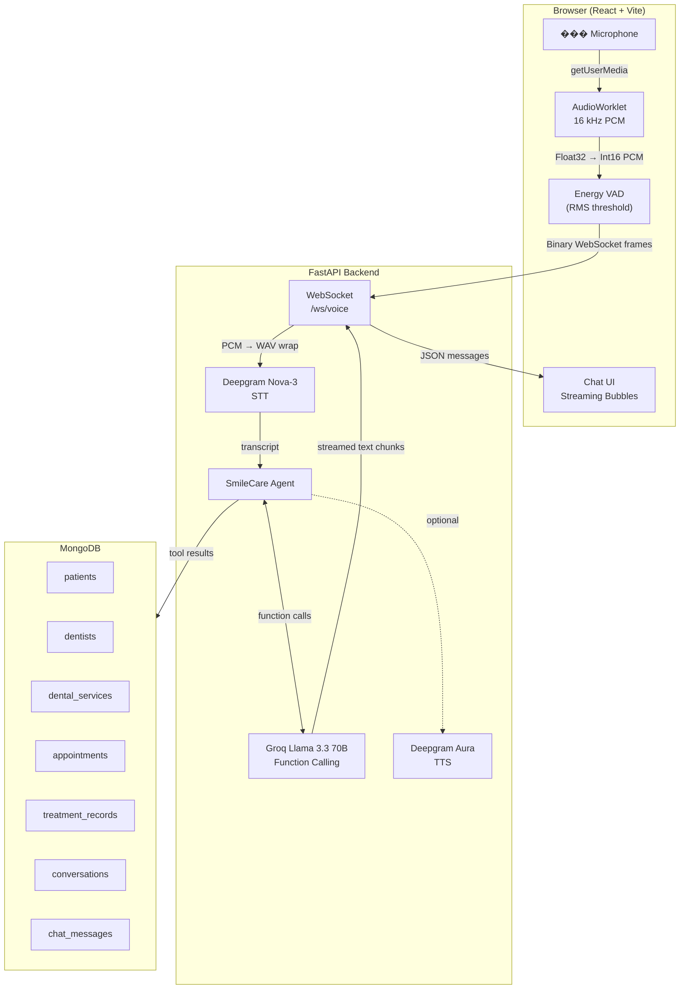
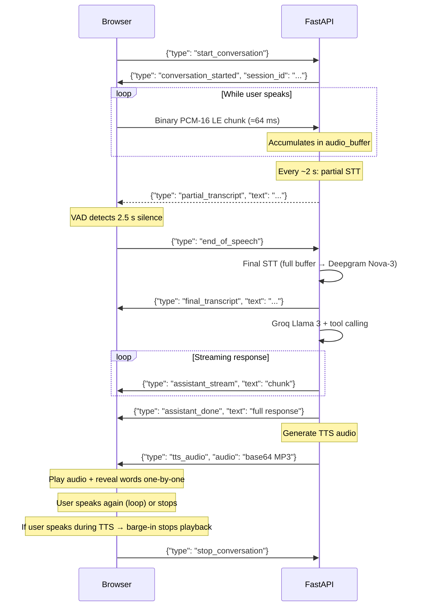
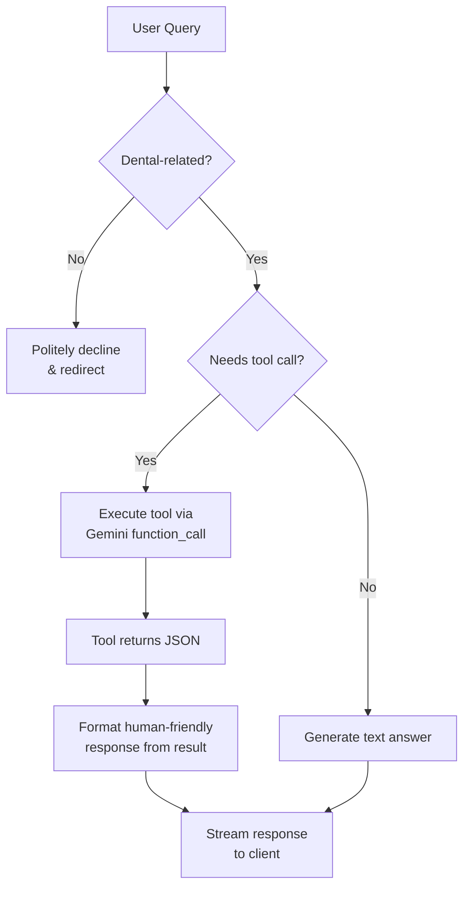
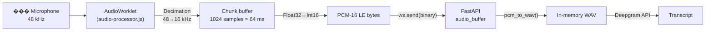
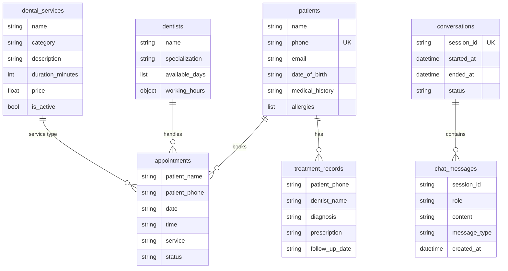

# SmileCare Dental Clinic – AI Voice Assistant

A real-time, voice-first AI receptionist for a dental clinic. Patients speak naturally into their browser; the system transcribes speech via **Deepgram Nova-3**, reasons and executes clinic operations through **Groq Llama 3.3 70B** function-calling, and speaks back via **Deepgram Aura TTS**. Supports two transport modes: a custom **WebSocket** pipeline with per-stage latency measurement, and **Vapi WebRTC** for fully managed low-latency voice streaming.

---

## Table of Contents

- [Architecture Overview](#architecture-overview)
- [Tech Stack](#tech-stack)
- [Transport Modes](#transport-modes)
- [WebSocket Protocol](#websocket-protocol)
- [Agent & Tool Calling](#agent--tool-calling)
- [Audio Pipeline](#audio-pipeline)
- [Latency Debug](#latency-debug)
- [Database Schema](#database-schema)
- [Project Structure](#project-structure)
- [Getting Started](#getting-started)
- [Environment Variables](#environment-variables)
- [API Reference](#api-reference)

---

## Architecture Overview



---

## Tech Stack

| Layer | Technology | Role |
|-------|-----------|------|
| **Frontend** | React 18 + Vite + Tailwind CSS 4 | SPA with AudioWorklet voice capture |
| **Backend** | FastAPI (Python 3.11+) | WebSocket server, REST API, routing |
| **LLM** | Groq Llama 3.3 70B Versatile | Conversational AI with JSON-schema function calling |
| **STT** | Deepgram Nova-3 | Real-time speech-to-text (REST via httpx) |
| **TTS** | Deepgram Aura (aura-asteria-en) | Text-to-speech (REST via httpx, MP3) |
| **Database** | MongoDB (pymongo) | 7 collections for full dental clinic data |
| **Audio** | Web AudioWorklet API | Low-latency 16 kHz PCM capture + VAD |

---

## Transport Modes

SmileCare supports two transport modes for voice conversations:

| Feature | WebSocket Mode | Vapi WebRTC Mode |
|---------|---------------|-----------------|
| **Transport** | WebSocket (`ws://`) | WebRTC (peer-to-peer) |
| **Pipeline** | Custom (our server handles STT/LLM/TTS) | Fully managed (Vapi cloud) |
| **STT** | Deepgram Nova-3 | Deepgram Nova-2 (Vapi) |
| **LLM** | Groq Llama 3.3 70B | Groq Llama 3.3 70B (Vapi) |
| **TTS** | Deepgram Aura | Deepgram Aura Asteria (Vapi) |
| **VAD** | Client-side sliding-window | Vapi server-side |
| **Latency debug** | Full per-stage + client round-trip | Tool execution timing + call report |
| **Tool execution** | Direct (in-process) | Webhook (`POST /vapi/webhook`) |
| **Required keys** | `GROQ_API_KEY`, `DEEPGRAM_API_KEY` | `VAPI_PUBLIC_KEY` |

Switch modes via the toggle in the header before starting a conversation. See `docs/VAPI_WEBRTC.md` for full Vapi integration details.

---

## WebSocket Protocol

A single persistent WebSocket at `/ws/voice` handles the entire conversation lifecycle.



### Message Reference

| Direction | `type` | Payload | Description |
|-----------|--------|---------|-------------|
| Client → Server | `start_conversation` | — | Begin a new session |
| Client → Server | *(binary)* | PCM-16 LE bytes | Audio chunk from AudioWorklet |
| Client → Server | `end_of_speech` | — | VAD silence threshold reached |
| Client → Server | `stop_conversation` | — | End session gracefully |
| Server → Client | `conversation_started` | `session_id` | Session created |
| Server → Client | `partial_transcript` | `text` | Interim STT result |
| Server → Client | `final_transcript` | `text` | Final STT after end_of_speech |
| Server → Client | `assistant_stream` | `text` | Streamed LLM response chunk |
| Server → Client | `assistant_done` | `text` | Full response delivered |
| Server → Client | `tts_audio` | `audio` (base64) | MP3 audio for playback |
| Server → Client | `tts_error` | `message` | TTS generation failed |
| Server → Client | `latency` | `stt_ms`, `llm_first_token_ms`, `llm_total_ms`, `tts_ms`, `total_ms`, `audio_duration_s` | Per-stage pipeline latency metrics |
| Server → Client | `error` | `message` | Error description |

---

## Agent & Tool Calling

The agent (`SmileCare AI`) enforces a **dental-only scope** — any off-topic question is politely declined. When a user request maps to a clinic action, Groq Llama 3.3 invokes one of 8 registered tools:



### Available Tools

| Tool | Purpose | Required Params |
|------|---------|-----------------|
| `check_available_slots` | List free 30-min slots for a date | `date` |
| `book_appointment` | Book an appointment | `patient_name`, `patient_phone`, `date`, `time` |
| `cancel_appointment` | Cancel by date + time | `date`, `time` |
| `reschedule_appointment` | Move to new date/time | `old_date`, `old_time`, `new_date`, `new_time` |
| `get_dental_services` | List services (optionally by category) | — |
| `get_clinic_info` | Return clinic hours, address, phone | — |
| `get_patient_appointments` | Look up patient bookings | `patient_phone` |
| `get_dentists` | List dentists (optionally by specialization) | — |

The tool-calling loop runs up to **3 rounds** (non-streaming) to resolve chained tool calls, then the final answer is **streamed** to the client with `tool_choice="none"` to ensure a plain text response.

---

## Audio Pipeline



### VAD (Voice Activity Detection)

The VAD uses a **sliding-window ratio-based** approach with multiple noise-rejection layers:

| Parameter | Value | Purpose |
|-----------|-------|---------|
| `CALIBRATION_DURATION_MS` | 2000 ms | Measure ambient noise floor |
| `NOISE_FLOOR_MULTIPLIER` | 6 | threshold = noise_floor × 6 |
| `MIN_ABSOLUTE_THRESHOLD` | 0.02 | Hard minimum RMS threshold |
| `SPEECH_WINDOW_MS` | 400 ms | Sliding window for ratio check |
| `SPEECH_RATIO` | 0.5 | ≥50% of frames above threshold = speech |
| `VAD_SILENCE_TIMEOUT_MS` | 2000 ms | Silence to trigger `end_of_speech` |
| `VAD_SPEECH_MIN_MS` | 600 ms | Minimum speech duration |
| `MAX_CREST_FACTOR` | 10 | peak/RMS above this = impulsive noise |
| `RMS_SMOOTHING_ALPHA` | 0.35 | EMA smoothing factor |
| `PRE_SPEECH_CHUNKS` | 15 | ~3.8 s pre-speech ring buffer |
| `TTS_INTERRUPT_MULTIPLIER` | 2.5 | Raised threshold during TTS for barge-in |

The system calibrates for 2 seconds on start, then uses a sliding window: if ≥50% of VAD frames in 400 ms are above the dynamic threshold, speech is confirmed. A 15-chunk ring buffer preserves the start of utterances. Audio is only sent to the backend when speech is confirmed. During TTS playback, the threshold is elevated ×2.5 to avoid echo while still allowing user interruption.

See `docs/VAD_IMPROVEMENTS.md` for detailed documentation.

---

## Latency Debug

Every voice turn is instrumented with per-stage latency measurement on both the server and client:

### Server-Side (Backend Logs)

All latency logs use the `[LATENCY]` prefix for easy filtering:

```bash
uvicorn app.main:app --reload 2>&1 | grep "[LATENCY]"
```

After each turn, the backend prints a summary:

```
[LATENCY][PIPELINE] ══════════════════════════════
[LATENCY][PIPELINE]  STT:     342 ms  (22%)  [wav=2ms + api=340ms]
[LATENCY][PIPELINE]  LLM:     920 ms  (60%)  [first_token=180ms, 8 chunks]
[LATENCY][PIPELINE]  TTS:     280 ms  (18%)  [18432 bytes MP3]
[LATENCY][PIPELINE]  TOTAL:  1542 ms  (audio captured: 2.1s)
[LATENCY][PIPELINE] ══════════════════════════════
```

### Client-Side (Debug Panel)

The debug panel (bottom-right toggle) shows:

- **Server metrics**: Color-coded per-stage latency with sub-stage breakdown (WAV conversion, API calls, chunk counts, MP3 size)
- **Client round-trip**: Browser-measured timing from `end_of_speech` → `final_transcript` → first stream → TTS audio, plus network overhead
- **Running averages**: Average pipeline time over the last 20 turns

### Vapi Webhook Latency

Tool execution time is logged with `[LATENCY][VAPI]` prefix for webhook-based tool calls.

See `docs/LATENCY_DEBUG.md` for a comprehensive guide on interpreting latency data, color codes, and optimization targets.

---

## Database Schema



**Seed data** (loaded on startup):
- 3 dentists (General, Orthodontics, Endodontics)
- 15 dental services across 7 categories (Preventive, Diagnostic, Restorative, Cosmetic, Surgical, Periodontic, Emergency)

---

## Project Structure

```
demo/
├── app/
│   ├── __init__.py
│   ├── main.py                  # FastAPI app, WebSocket /ws/voice, REST endpoints, latency debug
│   ├── database.py              # MongoDB connection, 7 collections, indexes, seed data
│   ├── models/
│   │   └── schema.py            # Pydantic schemas (Patient, Appointment, WSMessage, etc.)
│   ├── routers/
│   │   ├── clinic.py            # REST CRUD: /appointments, /services, /dentists, /dashboard
│   │   └── vapi_webhook.py      # Vapi server-URL webhook: POST /vapi/webhook (tool execution)
│   └── services/
│       ├── agent_service.py     # SmileCare AI agent, tool handlers, dental scope validation
│       ├── llm_service.py       # Groq Llama 3 client, 8 JSON-schema tools, streaming generator
│       └── voice_service.py     # Deepgram Nova-3 STT, Deepgram Aura TTS, pcm_to_wav
├── frontend/
│   ├── index.html
│   ├── package.json             # React 18, Vite, Tailwind CSS 4, @vapi-ai/web
│   ├── vite.config.js
│   ├── public/
│   │   └── audio-processor.js   # AudioWorklet processor (16 kHz downsample + RMS + peak)
│   └── src/
│       ├── main.jsx             # React root
│       ├── App.jsx              # Voice UI: VAD, TTS, barge-in, debug panel, Vapi WebRTC mode
│       └── index.css            # Tailwind imports
├── audio/                       # Generated TTS audio files (gitignored)
├── docs/
│   ├── ARCHITECTURE.md          # Detailed architecture docs with Mermaid diagrams
│   ├── LATENCY_DEBUG.md         # Latency debug guide: interpreting metrics & optimization
│   ├── VAPI_WEBRTC.md           # Vapi WebRTC integration: architecture, config, events
│   └── VAD_IMPROVEMENTS.md      # Detailed VAD & TTS documentation
├── .env.example                 # Backend environment template
├── requirements.txt             # Python dependencies
└── .env                         # API keys (not committed)
```

---

## Getting Started

### Prerequisites

- **Python 3.11+**
- **Node.js 18+**
- **MongoDB** (local or Atlas)

### 1. Clone & set up backend

```bash
git clone <repo-url>
cd demo

python -m venv venv
# Windows
venv\Scripts\activate
# macOS/Linux
source venv/bin/activate

pip install -r requirements.txt
```

### 2. Configure environment

Create a `.env` file in the project root:

```env
GROQ_API_KEY=your_groq_api_key
DEEPGRAM_API_KEY=your_deepgram_api_key
MONGO_URI=mongodb://localhost:27017

# Vapi WebRTC mode (optional — only needed for Vapi transport)
VAPI_PUBLIC_KEY=your_vapi_public_key

# Optional (commented-out providers in code):
# GOOGLE_API_KEY=your_gemini_api_key
# ELEVEN_API_KEY=your_elevenlabs_api_key
```

### 3. Start the backend

```bash
uvicorn app.main:app --reload --host 0.0.0.0 --port 8000
```

### 4. Start the frontend

```bash
cd frontend
npm install
npm run dev
```

The frontend runs at `http://localhost:5173` and connects to the backend at `http://localhost:8000`.

### 5. Use the app

1. Click **"Start Conversation"** — the browser requests microphone access
2. Wait 2 seconds for noise-floor calibration (amber pulsing indicator)
3. Speak naturally — the VAD detects speech and silence automatically
4. After 2 s of silence, your speech is transcribed and sent to the AI agent
5. The assistant responds with **voice (TTS)** — words appear one-by-one as it speaks
6. **Interrupt anytime** — speak while the assistant is talking to stop it and take over
7. Click **"Stop Conversation"** when done
8. Use the **debug panel** (bottom-right toggle) to monitor VAD events and **pipeline latency** in real time
9. Use the **floating info button** (bottom-right) to view clinic details, services, and dentists

---

## Environment Variables

| Variable | Required | Description |
|----------|----------|-------------|
| `GROQ_API_KEY` | Yes | Groq API key (Llama 3.3 70B LLM) |
| `DEEPGRAM_API_KEY` | Yes | Deepgram API key (Nova-3 STT + Aura TTS) |
| `MONGO_URI` | Yes | MongoDB connection string |
| `VAPI_PUBLIC_KEY` | No | Vapi public key (for WebRTC mode) |
| `GOOGLE_API_KEY` | No | Google Gemini API key (commented-out provider) |
| `ELEVEN_API_KEY` | No | ElevenLabs API key (commented-out provider) |

---

## API Reference

### WebSocket

| Endpoint | Description |
|----------|-------------|
| `ws://localhost:8000/ws/voice` | Real-time voice conversation (WebSocket mode) |

### Vapi Webhook

| Method | Endpoint | Description |
|--------|----------|-------------|
| `POST` | `/vapi/webhook` | Vapi server-URL webhook for tool execution (WebRTC mode) |

### REST

| Method | Endpoint | Description |
|--------|----------|-------------|
| `POST` | `/chat` | Text chat (non-streaming, for testing) |
| `GET` | `/history` | Retrieve chat messages |
| `POST` | `/appointments/book` | Book appointment |
| `DELETE` | `/appointments/{id}` | Cancel appointment |
| `GET` | `/appointments` | List appointments |
| `GET` | `/appointments/available` | Check available slots |
| `GET` | `/services` | List dental services |
| `GET` | `/dentists` | List dentists |
| `GET` | `/patients` | List patients |
| `GET` | `/dashboard/stats` | Clinic dashboard stats |

---

## License

MIT
