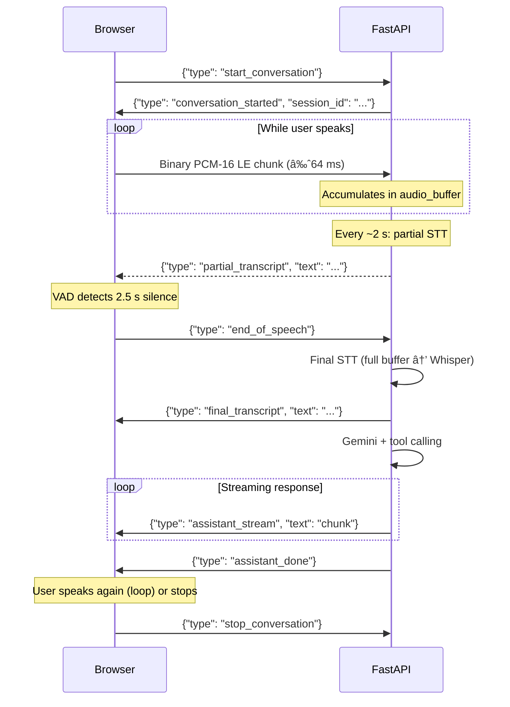
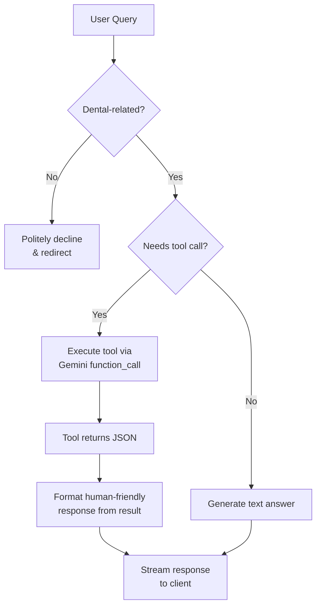
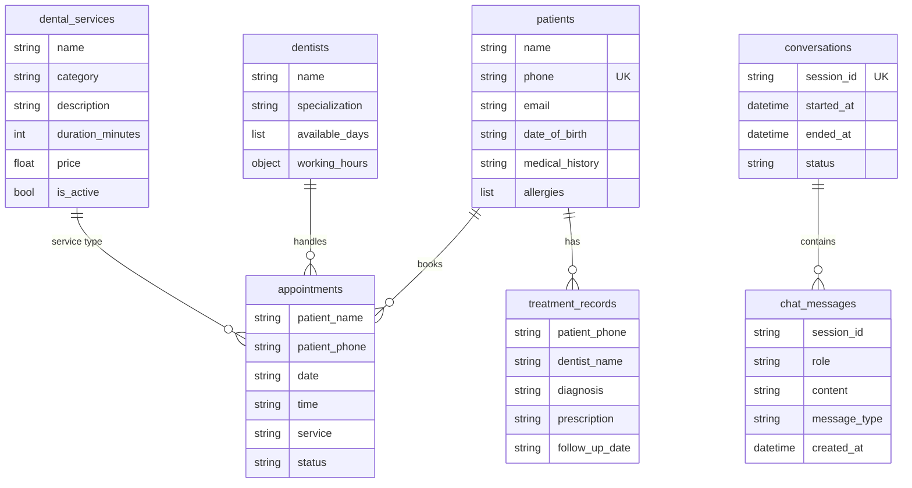

# SmileCare Dental Clinic – AI Voice Assistant

A real-time, voice-first AI receptionist for a dental clinic. Patients speak naturally into their browser; the system transcribes speech via Groq Whisper, reasons and executes clinic operations through Gemini function-calling, and streams text responses back — all over a single WebSocket connection.

---

## Table of Contents

- [Architecture Overview](#architecture-overview)
- [Tech Stack](#tech-stack)
- [WebSocket Protocol](#websocket-protocol)
- [Agent & Tool Calling](#agent--tool-calling)
- [Audio Pipeline](#audio-pipeline)
- [Database Schema](#database-schema)
- [Project Structure](#project-structure)
- [Getting Started](#getting-started)
- [Environment Variables](#environment-variables)
- [API Reference](#api-reference)

---

## Architecture Overview

```mermaid
graph TB
  subgraph Browser ["Browser (React + Vite)"]
    MIC["í¾¤ Microphone"]
    AW["AudioWorklet<br/>16 kHz PCM"]
    VAD["Energy VAD<br/>(RMS threshold)"]
    UI["Chat UI<br/>Streaming Bubbles"]
  end

  subgraph Server ["FastAPI Backend"]
    WS["WebSocket<br/>/ws/voice"]
    STT["Groq Whisper<br/>Large v3"]
    AGENT["SmileCare Agent"]
    LLM["Gemini 2.5 Flash<br/>Function Calling"]
    TTS["ElevenLabs / gTTS"]
  end

  subgraph DB ["MongoDB"]
    PATIENTS["patients"]
    DENTISTS["dentists"]
    SERVICES["dental_services"]
    APPTS["appointments"]
    TREATMENTS["treatment_records"]
    CONVOS["conversations"]
    MSGS["chat_messages"]
  end

  MIC -->|"getUserMedia"| AW
  AW -->|"Float32 → Int16 PCM"| VAD
  VAD -->|"Binary WebSocket frames"| WS
  WS -->|"PCM → WAV wrap"| STT
  STT -->|"transcript"| AGENT
  AGENT <-->|"function calls"| LLM
  AGENT -->|"tool results"| DB
  LLM -->|"streamed text chunks"| WS
  WS -->|"JSON messages"| UI
  AGENT -.->|"optional"| TTS
```



---

## Tech Stack

| Layer | Technology | Role |
|-------|-----------|------|
| **Frontend** | React 18 + Vite + Tailwind CSS 4 | SPA with AudioWorklet voice capture |
| **Backend** | FastAPI (Python 3.11+) | WebSocket server, REST API, routing |
| **LLM** | Google Gemini 2.5 Flash | Conversational AI with native function calling |
| **STT** | Groq Whisper Large v3 | Real-time speech-to-text |
| **TTS** | ElevenLabs (primary) / gTTS (fallback) | Text-to-speech |
| **Database** | MongoDB (pymongo) | 7 collections for full dental clinic data |
| **Audio** | Web AudioWorklet API | Low-latency 16 kHz PCM capture + VAD |

---

## WebSocket Protocol

A single persistent WebSocket at `/ws/voice` handles the entire conversation lifecycle.



### Message Reference

| Direction | `type` | Payload | Description |
|-----------|--------|---------|-------------|
| Client → Server | `start_conversation` | — | Begin a new session |
| Client → Server | *(binary)* | PCM-16 LE bytes | Audio chunk from AudioWorklet |
| Client → Server | `end_of_speech` | — | VAD silence threshold reached |
| Client → Server | `stop_conversation` | — | End session gracefully |
| Server → Client | `conversation_started` | `session_id` | Session created |
| Server → Client | `partial_transcript` | `text` | Interim STT result |
| Server → Client | `final_transcript` | `text` | Final STT after end_of_speech |
| Server → Client | `assistant_stream` | `text` | Streamed LLM response chunk |
| Server → Client | `assistant_done` | — | Full response delivered |
| Server → Client | `error` | `message` | Error description |

---

## Agent & Tool Calling

The agent (`SmileCare AI`) enforces a **dental-only scope** — any off-topic question is politely declined. When a user request maps to a clinic action, Gemini invokes one of 8 registered tools:



### Available Tools

| Tool | Purpose | Required Params |
|------|---------|-----------------|
| `check_available_slots` | List free 30-min slots for a date | `date` |
| `book_appointment` | Book an appointment | `patient_name`, `patient_phone`, `date`, `time` |
| `cancel_appointment` | Cancel by date + time | `date`, `time` |
| `reschedule_appointment` | Move to new date/time | `old_date`, `old_time`, `new_date`, `new_time` |
| `get_dental_services` | List services (optionally by category) | — |
| `get_clinic_info` | Return clinic hours, address, phone | — |
| `get_patient_appointments` | Look up patient bookings | `patient_phone` |
| `get_dentists` | List dentists (optionally by specialization) | — |

The tool-calling loop runs up to **3 rounds** (non-streaming) to resolve chained tool calls, then the final answer is **streamed** to the client via `generate_content_stream`.

---

## Audio Pipeline

```mermaid
flowchart LR
  MIC["í¾¤ Microphone<br/>48 kHz"] --> WK["AudioWorklet<br/>(audio-processor.js)"]
  WK -->|"Decimation<br/>48→16 kHz"| BUF["Chunk buffer<br/>1024 samples ≈ 64 ms"]
  BUF -->|"Float32→Int16"| PCM["PCM-16 LE bytes"]
  PCM -->|"ws.send(binary)"| SRV["FastAPI<br/>audio_buffer"]
  SRV -->|"pcm_to_wav()"| WAV["In-memory WAV"]
  WAV -->|"Groq API"| TXT["Transcript"]
```



### VAD (Voice Activity Detection)

| Parameter | Value | Purpose |
|-----------|-------|---------|
| `VAD_SILENCE_THRESHOLD` | 0.008 | RMS energy below this = silence |
| `VAD_SILENCE_TIMEOUT_MS` | 2500 ms | Consecutive silence to trigger `end_of_speech` |
| `VAD_SPEECH_MIN_MS` | 500 ms | Minimum speech duration before silence is respected |

The AudioWorklet computes RMS on every `process()` call and posts `{type:'vad', rms}` to the main thread. The main thread runs a timer-based state machine: once speech is detected (RMS > threshold), a silence timer starts on the first quiet frame and fires `end_of_speech` after 2.5 s.

---

## Database Schema



**Seed data** (loaded on startup):
- 3 dentists (General, Orthodontics, Endodontics)
- 15 dental services across 7 categories (Preventive, Diagnostic, Restorative, Cosmetic, Surgical, Periodontic, Emergency)

---

## Project Structure

```
demo/
├── app/
│   ├── __init__.py
│   ├── main.py                  # FastAPI app, WebSocket /ws/voice, REST endpoints
│   ├── database.py              # MongoDB connection, 7 collections, indexes, seed data
│   ├── models/
│   │   └── schema.py            # Pydantic schemas (Patient, Appointment, WSMessage, etc.)
│   ├── routers/
│   │   └── clinic.py            # REST CRUD: /appointments, /services, /dentists, /dashboard
│   └── services/
│       ├── agent_service.py     # SmileCare AI agent, tool handlers, dental scope validation
│       ├── llm_service.py       # Gemini client, 8 FunctionDeclarations, streaming generator
│       └── voice_service.py     # Groq Whisper STT, ElevenLabs/gTTS TTS, pcm_to_wav
├── frontend/
│   ├── index.html
│   ├── package.json             # React 18, Vite, Tailwind CSS 4
│   ├── vite.config.js
│   ├── public/
│   │   └── audio-processor.js   # AudioWorklet processor (16 kHz downsample + VAD RMS)
│   └── src/
│       ├── main.jsx             # React root
│       ├── App.jsx              # Voice UI: Start/Stop, AudioWorklet, VAD, streaming chat
│       └── index.css            # Tailwind imports
├── audio/                       # Generated TTS audio files (gitignored)
├── requirements.txt             # Python dependencies
├── ARCHITECTURE.md              # Detailed architecture docs with Mermaid diagrams
└── .env                         # API keys (not committed)
```

---

## Getting Started

### Prerequisites

- **Python 3.11+**
- **Node.js 18+**
- **MongoDB** (local or Atlas)

### 1. Clone & set up backend

```bash
git clone <repo-url>
cd demo

python -m venv venv
# Windows
venv\Scripts\activate
# macOS/Linux
source venv/bin/activate

pip install -r requirements.txt
```

### 2. Configure environment

Create a `.env` file in the project root:

```env
GOOGLE_API_KEY=your_gemini_api_key
GROQ_API_KEY=your_groq_api_key
ELEVEN_API_KEY=your_elevenlabs_api_key
MONGO_URI=mongodb://localhost:27017
```

### 3. Start the backend

```bash
uvicorn app.main:app --reload --host 0.0.0.0 --port 8000
```

### 4. Start the frontend

```bash
cd frontend
npm install
npm run dev
```

The frontend runs at `http://localhost:5173` and connects to the backend at `http://localhost:8000`.

### 5. Use the app

1. Click **"Start Conversation"** — the browser requests microphone access
2. Speak naturally — the VAD detects speech and silence automatically
3. After 2.5 s of silence, your speech is transcribed and sent to the AI agent
4. The agent's response streams in real-time as chat bubbles
5. Click **"Stop Conversation"** when done

---

## Environment Variables

| Variable | Required | Description |
|----------|----------|-------------|
| `GOOGLE_API_KEY` | Yes | Google Gemini API key |
| `GROQ_API_KEY` | Yes | Groq API key for Whisper STT |
| `ELEVEN_API_KEY` | No | ElevenLabs API key (falls back to gTTS) |
| `MONGO_URI` | Yes | MongoDB connection string |

---

## API Reference

### WebSocket

| Endpoint | Description |
|----------|-------------|
| `ws://localhost:8000/ws/voice` | Real-time voice conversation |

### REST

| Method | Endpoint | Description |
|--------|----------|-------------|
| `POST` | `/chat` | Text chat (non-streaming, for testing) |
| `GET` | `/history` | Retrieve chat messages |
| `POST` | `/appointments/book` | Book appointment |
| `DELETE` | `/appointments/{id}` | Cancel appointment |
| `GET` | `/appointments` | List appointments |
| `GET` | `/appointments/available` | Check available slots |
| `GET` | `/services` | List dental services |
| `GET` | `/dentists` | List dentists |
| `GET` | `/patients` | List patients |
| `GET` | `/dashboard/stats` | Clinic dashboard stats |

---

## License

MIT
