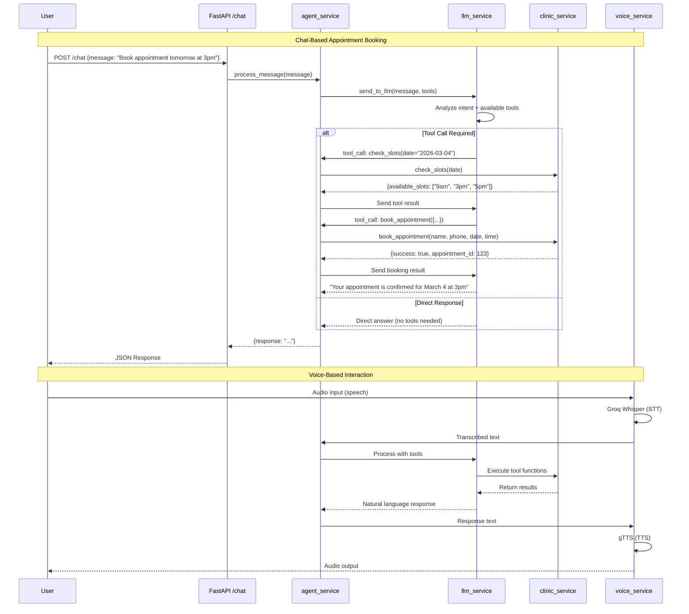
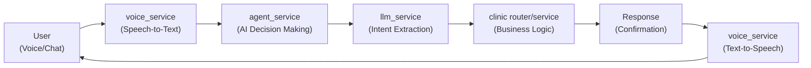
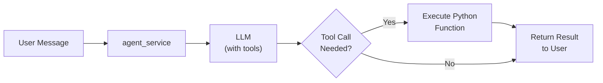
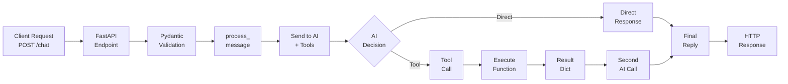
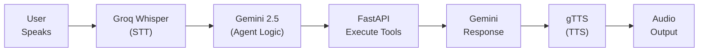
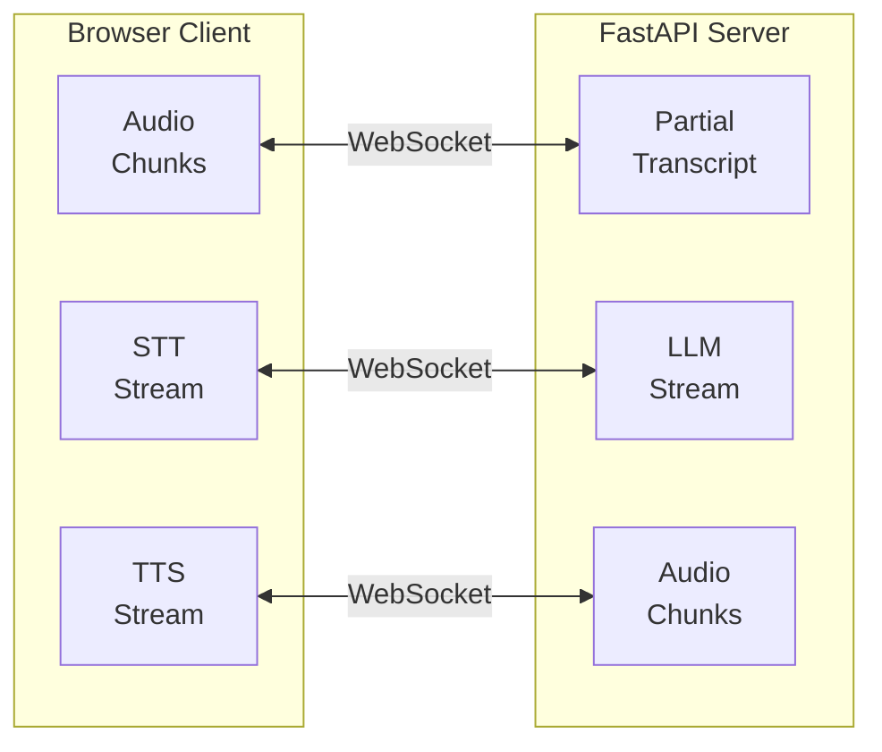

# AI-Powered Dental Clinic Scheduling System

An intelligent AI assistant that handles appointment booking via voice and chat interactions. The system uses advanced language models with tool-calling capabilities to manage patient inquiries and appointments.

## Table of Contents

- [Overview](#overview)
- [Quick Start](#quick-start)
- [Voice Implementation Evolution](#voice-implementation-evolution)
- [WebSocket Real-Time Voice Processing](#websocket-real-time-voice-processing)
- [Complete Application Flow](#complete-application-flow)
- [System Architecture](#system-architecture)
- [Project Structure](#project-structure)
- [Future Enhancements](#future-enhancements)

---

## Overview

This application provides a conversational AI interface for a dental clinic that handles:
- **Appointment booking** through natural language conversation
- **Slot availability checking** for requested dates
- **Voice-based interactions** with speech-to-text and text-to-speech
- **Multi-channel communication** via WebSocket and REST API

---

## Quick Start

### Prerequisites
- Python 3.9+
- Node.js 18+
- OpenAI API key (for Whisper)
- ElevenLabs API key (for TTS)
- Groq API key (for LLM)

### Backend Setup

```bash
# Create virtual environment
python -m venv venv

# Activate venv
# Windows:
venv\Scripts\activate
# macOS/Linux:
source venv/bin/activate

# Install dependencies
pip install -r requirements.txt

# Create .env file with API keys
cat > .env << EOF
GROQ_API_KEY=your_groq_key
ELEVEN_API_KEY=your_elevenlabs_key
OPENAI_API_KEY=your_openai_key
EOF

# Run backend
uvicorn app.main:app --reload
```

Backend runs on `http://localhost:8000`

### Frontend Setup

```bash
cd frontend
npm install
npm run dev
```

Frontend runs on `http://localhost:5173`

---

## Voice Implementation Evolution

### Initial Approach: REST API with File Upload

**What it was:**
- Frontend recorded audio chunks using MediaRecorder
- Chunks were streamed in real-time to backend via individual messages
- On stop, a `final` message triggered backend processing
- Backend concatenated all chunks and processed them

**Why it failed after the first request:**
1. **WebSocket Connection Closure**: Exception handling was outside the message loop, so any error during STT/processing caused the entire WebSocket to close
2. **Webm Container Corruption**: MediaRecorder produces webm chunks, and concatenating raw binary chunks destroys the webm container structure - no metadata, invalid file format
3. **Groq API Rejection**: When Groq tried to transcribe the corrupted webm file, it returned "Error code: 400 - could not process file - is it a valid media file?"
4. **Disabled Mic Button**: Connection closure triggered the frontend to disable the mic button and show "Voice socket disconnected"

---

## WebSocket Real-Time Voice Processing

### The New Solution

**How it works now:**
1. Frontend collects all audio chunks in memory during recording (not sent individually)
2. On stop, chunks are combined into a **single complete webm Blob**
3. The complete blob is base64-encoded and sent in one `audio_data` message
4. Backend processes the complete, valid webm file
5. Error handling is **inside the message loop** - failures don't kill the connection

### Message Flow

```
Frontend                                Backend
  |                                        |
  |-- WebSocket Connect ----------------->|
  |<--------- socket_open events ---------|
  |                                        |
  |-- Start Recording                      |
  |    (collect chunks)                    |
  |                                        |
  |-- Stop Recording                       |
  |    (combine all chunks into blob)      |
  |    (base64 encode)                     |
  |                                        |
  |-- audio_data {complete blob} -------->|-- Save temp webm
  |                                        |-- STT (Groq Whisper)
  |<--------- transcription event ------------ Send user text
  |                                        |
  |                                        |-- Process with Agent
  |<--------- agent_text event ------------ Send assistant text
  |                                        |
  |                                        |-- TTS (ElevenLabs)
  |<--------- audio_ready event ----------- Send /audio/{id}.mp3 URL
  |                                        |
  |-- Play audio                           |
  |                                        |
  |-- Ready for next turn ✓                |
```

### Backend WebSocket Events

```json
// Frontend sends (once per recording):
{
  "type": "audio_data",
  "data": "base64-encoded-complete-webm-blob"
}

// Backend responds with sequence:
// 1. User's speech as text
{
  "type": "transcription",
  "text": "user said this"
}

// 2. Agent's response
{
  "type": "agent_text",
  "text": "assistant says this"
}

// 3. Playable audio URL
{
  "type": "audio_ready",
  "audio_url": "/audio/response_<uuid>.mp3"
}

// If error occurs at any step:
{
  "type": "error",
  "message": "descriptive error message"
}
```

### Key Improvements

| Aspect | Before | After |
|--------|--------|-------|
| **Audio Handling** | Streamed raw chunks | Complete blob sent once |
| **Webm Format** | Chunks concatenated (corrupted) | Valid webm file |
| **Error Resilience** | One error kills connection | Errors caught, connection stays alive |
| **Mic Button** | Disabled after first request | Always functional for multiple requests |
| **Message Structure** | Complex `audio_chunk` + `final` flow | Simple `audio_data` message |
| **Auto-Reconnect** | None | 2-second exponential backoff |
| **Debug Panel** | None | Live socket state, chunk counters, event timeline |

---

## Conversation Lifecycle Management

### The Problem: Always-Open Connections

The initial implementation auto-connected on page load and auto-reconnected after any disconnect. This created issues:
- No clear session boundaries for users
- Hard to tell if socket was active
- Difficult to stop a conversation intentionally
- Unclear error states

### The Solution: Explicit Start/Stop Control

**New approach:**
- Page loads with **no WebSocket connection**
- User clicks "Start Conversation" to open session
- WebSocket persists across **multiple turns** (voice + text interleaved)
- User clicks "Stop Conversation" to close session cleanly
- Disconnects only auto-reconnect if conversation is still active

### Session State Machine

```
[DISCONNECTED]
     ↑     ↓
     │  Click Start
     │     ↓
     │ [CONNECTING]
     │     ↓
     │  ↓ Success
     │  [OPEN] ← Multiple turns happen here
     │     ↓
     │  Click Stop  OR  Network fails
     │     ↓
     └─ [CLOSED] ← No auto-reconnect if user clicked stop
```

### Multiple Turns Behavior

Once conversation is started, users can:
- Record **multiple voice messages** without reconnecting
- Send **multiple text messages** without reconnecting
- **Interleave** voice and text seamlessly
- **Continuous socket** - no reconnections between turns
- **Shared context** - agent remembers conversation history

Example sequence:
```
User: "Schedule appointment" (voice)
  ↓
Assistant: "What date?" (response)
  ↓
User: "March 25th" (text)
  ↓
Assistant: "What time?" (response)
  ↓
User: "5 PM" (voice)
  ↓
Assistant: "Confirmed!" (response)
  ↓
(Socket stayed open the entire time)
```

### Auto-Reconnection Safety

**When conversation is ACTIVE:**
- Network disconnect → Auto-reconnect attempts every 2 seconds
- Backend crash → Keep attempting until server restarts
- Seamless recovery → User can continue immediately

**When conversation is STOPPED:**
- Network disconnect → **No reconnection attempt**
- Socket closes → Stays closed
- User must click "Start Conversation" again
- Fresh session boundaries

This prevents background reconnection attempts when user intentionally stopped.

### Frontend Implementation

**Key state variables:**
```javascript
conversationActive        // Track if user clicked "Start"
conversationActiveRef     // Ref version for callbacks (doesn't change)
```

**Key functions:**
```javascript
startConversation()       // Opens SessionID + WebSocket
stopConversation()        // Closes WebSocket + resets state
connectWebSocket(isAutoReconnect)  // Only reconnects if conversationActive
```

---
{
    "transcription": "...",
    "response": "...",
    "audio_url": "/audio/response_xxx.mp3"
}
```

Frontend flow:

`Mic → POST /voice → STT → Agent → DB → TTS → JSON(audio_url) → Play audio + update chat panel`

---

## Complete Application Flow

### End-to-End Sequence Diagram



---

## System Architecture

### Core Components



### Tool-Based Agent Pattern



---

## Request Flow

### REST API Workflow



---

## Voice Processing

### Voice-Only Workflow



---

## WebSocket Communication

For real-time, streaming interactions:



---

## Project Structure

```
demo/
├── Readme.md                 # Project documentation
├── requirements.txt          # Python dependencies
└── app/
    ├── __init__.py
    ├── main.py              # FastAPI application entry point
    ├── models/
    │   ├── __init__.py
    │   └── schema.py        # Pydantic request/response schemas
    ├── routers/
    │   ├── __init__.py
    │   └── clinic.py        # Appointment booking endpoints
    └── services/
        ├── __init__.py
        ├── agent_service.py # AI agent orchestration
        ├── llm_service.py   # LLM interactions & tool calling
        └── voice_service.py # Speech-to-text & text-to-speech
```

---

## Future Enhancements

- **User Authentication**: Register users in the system for persistent profiles
- **Confirmations**: Send SMS/Email/in-app notifications after appointment booking
- **Appointment Management**: Allow users to reschedule or cancel appointments
- **Multi-language Support**: Extend voice processing to support multiple languages
- **Analytics Dashboard**: Track bookings, common queries, and system performance
- **Calendar Integration**: Sync with clinic management systems
- **Appointment Reminders**: Automated reminders via SMS/email before appointments