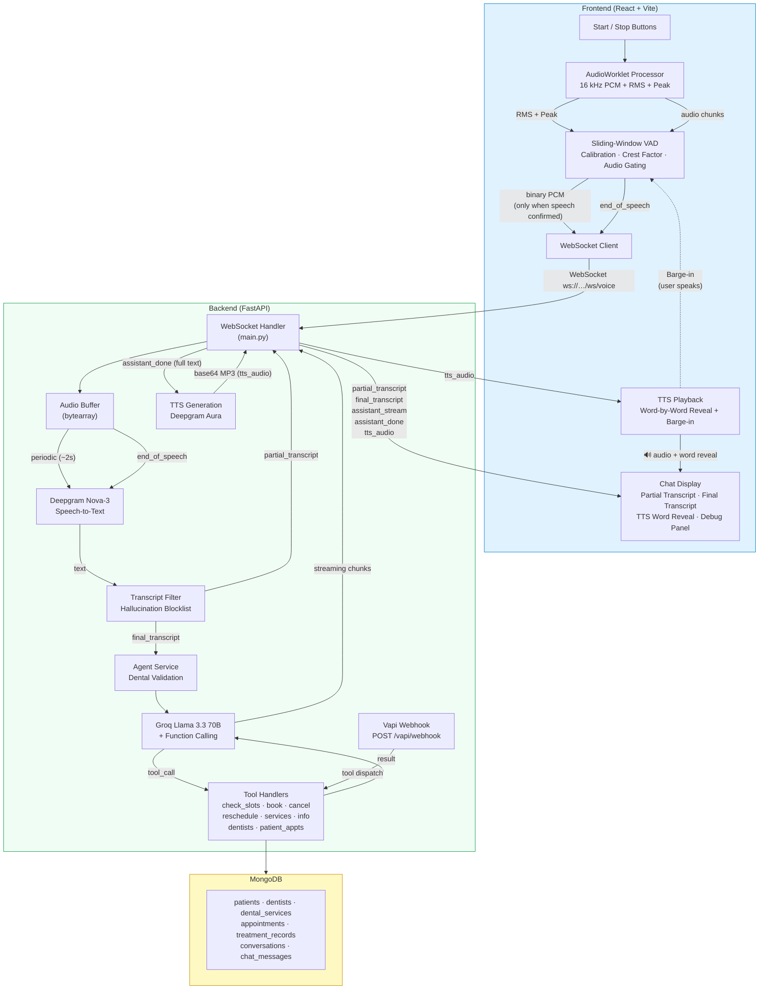
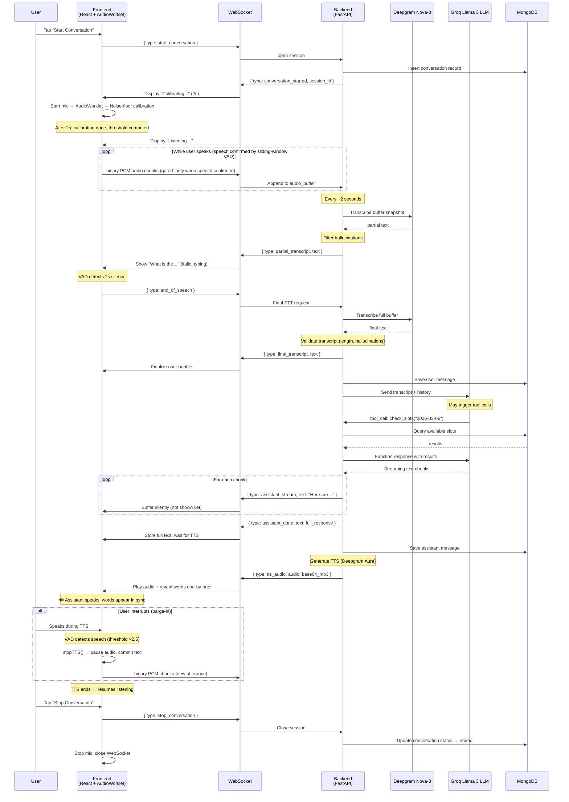
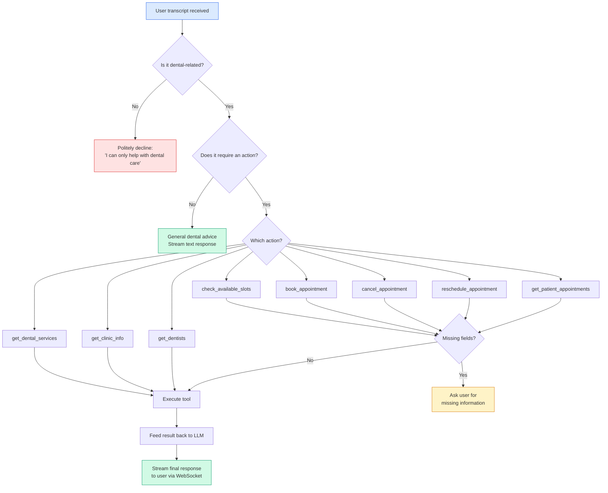
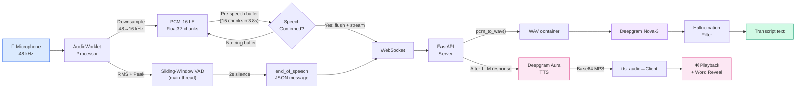
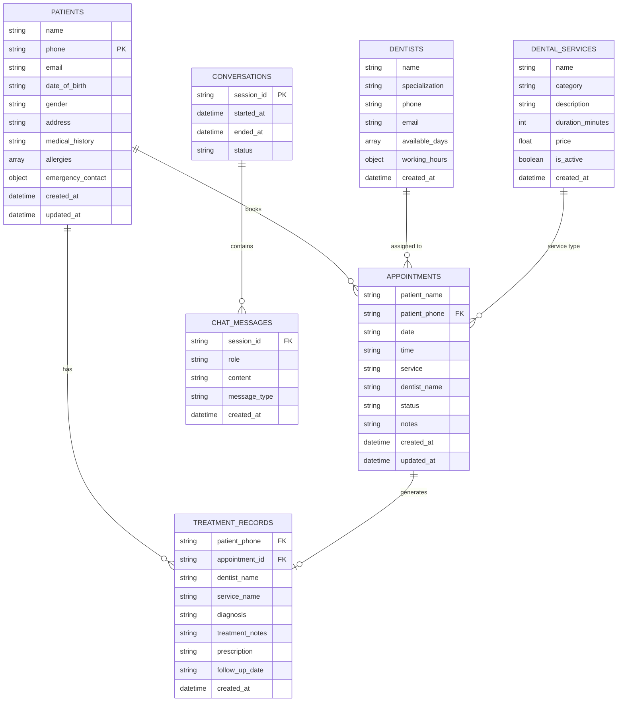
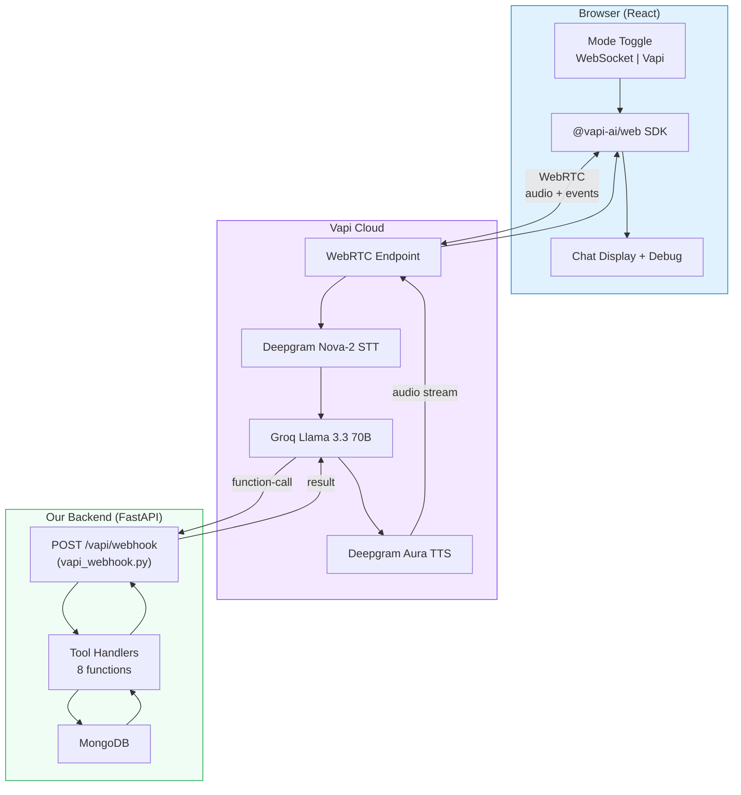

# SmileCare Dental Clinic – AI Voice Conversation System

## System Architecture (Mermaid)

### High-Level System Overview



### WebSocket Conversation Flow



### Agent Tool-Calling Decision Flow



### Audio Pipeline (AudioWorklet → STT)



### Database Entity Relationships



---

## System Architecture (ASCII)

```
┌────────────────────────────────────────────────────────────────────────┐
│                        FRONTEND (React + Vite)                         │
│                                                                        │
│  ┌────────────┐   ┌──────────────────┐   ┌──────────────────┐         │
│  │  Start /    │   │  AudioWorklet    │   │  WebSocket       │         │
│  │  Stop Btns  │──>│  Processor       │──>│  Client          │         │
│  └────────────┘   │  (16kHz PCM)     │   │                  │         │
│                    │  + RMS + Peak    │   │  ┌────────────┐  │         │
│                    └───────┬──────────┘   │  │ audio_chunk │──┼──> binary PCM
│                            │              │  │ end_speech  │──┼──> JSON ctrl
│                            ▼              │  └────────────┘  │         │
│                  ┌──────────────────┐     │                  │         │
│                  │ Sliding-Window   │     │                  │         │
│                  │ VAD (main thread)│     │                  │         │
│                  │ • Calibration    │     │                  │         │
│                  │ • Crest factor   │     │                  │         │
│                  │ • Audio gating   │     │                  │         │
│                  │ • Pre-speech buf │     │                  │         │
│                  │ • TTS barge-in   │     │                  │         │
│                  └──────────────────┘     │                  │         │
│                                           │                  │         │
│  ┌──────────────────────────────────────┐ │                  │         │
│  │  Chat Display                        │ │                  │         │
│  │  - partial_transcript (italic)       │<┼──partial_txn     │         │
│  │  - final_transcript → chat bubble    │<┼──final_txn       │         │
│  │  - assistant_stream → buffered       │<┼──asst_stream     │         │
│  │  - assistant_done → store text       │<┼──asst_done       │         │
│  │  - tts_audio → 🔊 word-by-word      │<┼──tts_audio       │         │
│  └──────────────────────────────────────┘ └──────────────────┘         │
│                                                                        │
│  ┌──────────────────────────────────────┐                              │
│  │  TTS Playback Engine                 │                              │
│  │  - Decode base64 → Blob → Audio     │                              │
│  │  - Word-by-word reveal (setInterval) │                              │
│  │  - Barge-in: stopTTS() on speech     │                              │
│  │  - Fallback: show text on error      │                              │
│  └──────────────────────────────────────┘                              │
│                                                                        │
│  ┌─────────────────────┐                                               │
│  │  Debug Panel         │  Collapsible, timestamped, color-coded logs  │
│  └─────────────────────┘                                               │
└────────────────────────────────────────────────────────────────────────┘
                              │  WebSocket (ws://…/ws/voice)
                              ▼
┌────────────────────────────────────────────────────────────────────────┐
│                     BACKEND (FastAPI + WebSocket)                       │
│                                                                        │
│  ┌──────────────┐   ┌──────────────────┐   ┌────────────────┐         │
│  │  WS Handler  │──>│  Audio Buffer    │──>│  Deepgram       │         │
│  │  (main.py)   │   │  (bytearray)     │   │  Nova-3 STT     │         │
│  └──────┬───────┘   └──────────────────┘   └───────┬────────┘         │
│         │                                           │                  │
│         │  periodic (every ~2s)                     ▼                  │
│         │  ──────────────────>  partial_transcript                     │
│         │                      (hallucination filter applied)          │
│         │                                                              │
│         │  end_of_speech                                               │
│         │  ──────────────────>  final_transcript                       │
│         │                            │                                 │
│         │                            ▼                                 │
│         │                  ┌──────────────────┐                        │
│         │                  │  Agent Service    │                        │
│         │                  │  ┌────────────┐  │                        │
│         │                  │  │ Dental      │  │                        │
│         │                  │  │ Validation  │  │                        │
│         │                  │  └────────────┘  │                        │
│         │                  │  ┌────────────┐  │                        │
│         │                  │  │ Groq Llama  │  │                        │
│         │                  │  │ 3.3 70B     │  │                        │
│         │                  │  │ + Tool Call │  │                        │
│         │                  └────────┼─────────┘                        │
│         │                           │                                  │
│         │                           ▼                                  │
│         │                  ┌──────────────────┐                        │
│         │                  │  Tool Handlers    │                        │
│         │                  │  - check_slots    │                        │
│         │                  │  - book_appt      │                        │
│         │                  │  - cancel_appt    │                        │
│         │                  │  - reschedule     │                        │
│         │                  │  - get_services   │                        │
│         │                  │  - get_info       │                        │
│         │                  │  - get_dentists   │                        │
│         │                  │  - get_patient    │                        │
│         │                  └────────┬─────────┘                        │
│         │                           │                                  │
│         │            streaming chunks│                                  │
│         │<──── assistant_stream ─────┘                                  │
│         │<──── assistant_done (with full text)                          │
│         │                                                              │
│         │      ┌──────────────────────────┐                            │
│         │──────│  TTS Generation          │                            │
│         │      │  Deepgram Aura           │                            │
│         │      └──────────┬───────────────┘                            │
│         │<──── tts_audio (base64 MP3)                                  │
│         │<──── tts_error (on failure)                                  │
│         │                                                              │
│         ▼                                                              │
│  ┌──────────────┐                                                      │
│  │  MongoDB      │  Collections:                                        │
│  │               │  - patients           - conversations                │
│  │               │  - dentists           - chat_messages                │
│  │               │  - dental_services                                   │
│  │               │  - appointments                                      │
│  │               │  - treatment_records                                 │
│  └──────────────┘                                                      │
└────────────────────────────────────────────────────────────────────────┘
```

---

## WebSocket Message Schema

### Client → Server

| Message | Format | Description |
|---------|--------|-------------|
| `start_conversation` | `{ "type": "start_conversation" }` | Opens a new session, mic starts automatically |
| `audio_chunk` | **Binary** (PCM-16 LE, 16 kHz, mono) | Raw audio from AudioWorklet, sent continuously |
| `end_of_speech` | `{ "type": "end_of_speech" }` | VAD detected 2 s silence → triggers final STT + LLM |
| `stop_conversation` | `{ "type": "stop_conversation" }` | Ends session, closes connection |

### Server → Client

| Message | Format | Description |
|---------|--------|-------------|
| `conversation_started` | `{ "type": "conversation_started", "session_id": "uuid" }` | Session initialized |
| `partial_transcript` | `{ "type": "partial_transcript", "text": "What is" }` | Interim STT result (every ~2 s) |
| `final_transcript` | `{ "type": "final_transcript", "text": "What is the weather" }` | Final STT after end-of-speech (filtered) |
| `assistant_stream` | `{ "type": "assistant_stream", "text": "The weather" }` | Streamed LLM response chunk |
| `assistant_done` | `{ "type": "assistant_done", "text": "full response" }` | LLM response complete (includes full text) |
| `tts_audio` | `{ "type": "tts_audio", "audio": "base64..." }` | TTS MP3 audio for playback |
| `tts_error` | `{ "type": "tts_error", "message": "..." }` | TTS generation failed |
| `latency` | `{ "type": "latency", "stt_ms": N, "llm_first_token_ms": N, "llm_total_ms": N, "tts_ms": N, "total_ms": N, "audio_duration_s": N }` | Per-stage pipeline latency metrics |
| `error` | `{ "type": "error", "message": "..." }` | Error notification |

---

## Example Conversation Flow

```
1.  User taps [Start Conversation]
2.  Client → Server:  { "type": "start_conversation" }
3.  Server → Client:  { "type": "conversation_started", "session_id": "abc-123" }
4.  Mic starts, AudioWorklet captures 16 kHz PCM
    2-second calibration phase (amber indicator, noise floor measured)

5.  User says: "What appointments are available tomorrow?"
    Sliding-window VAD confirms speech → pre-speech buffer flushed
    Client → Server:  [binary PCM chunks streamed while speech confirmed]

    ~2 s later:
    Server → Client:  { "type": "partial_transcript", "text": "What appointments" }

6.  User stops speaking (2 s silence detected by VAD)
    Client → Server:  { "type": "end_of_speech" }

7.  Server → Client:  { "type": "final_transcript",
                         "text": "What appointments are available tomorrow?" }

8.  Server calls Groq Llama 3 → tool call: check_available_slots("2026-03-06")
    → executes tool → feeds result back → streams final response

9.  Server → Client:  { "type": "assistant_stream", "text": "Here are the " }
    Server → Client:  { "type": "assistant_stream", "text": "available slots " }
    Server → Client:  { "type": "assistant_stream", "text": "for tomorrow..." }

10. Server → Client:  { "type": "assistant_done", "text": "Here are the available slots for tomorrow..." }

11. Server generates TTS audio (Deepgram Aura)
    Server → Client:  { "type": "tts_audio", "audio": "base64..." }

12. Frontend plays MP3 audio, words appear one-by-one in chat bubble (🔊 icon)
    Footer shows violet pulsing speaker icon with "Speaking…" label

13. (Optional) User speaks during TTS → barge-in detected
    Audio stops, text committed, system transitions to listening

14. TTS ends naturally → system resumes listening for next utterance.

15. User taps [Stop Conversation]
    Client → Server:  { "type": "stop_conversation" }
    WebSocket closes, mic stops.
```

---

## Database Schema

### patients
| Field | Type | Description |
|-------|------|-------------|
| `name` | string | Patient full name |
| `phone` | string | Primary phone (unique index) |
| `email` | string | Email address |
| `date_of_birth` | string | YYYY-MM-DD |
| `gender` | string | Gender |
| `address` | string | Postal address |
| `medical_history` | string | Notes |
| `allergies` | string[] | Known allergies |
| `emergency_contact` | {name, phone} | Emergency contact |
| `created_at` | datetime | Record creation |
| `updated_at` | datetime | Last update |

### dentists
| Field | Type | Description |
|-------|------|-------------|
| `name` | string | Dr. full name |
| `specialization` | string | General, Orthodontics, Endodontics, etc. |
| `phone` | string | Contact |
| `email` | string | Email |
| `available_days` | string[] | ["Monday", "Tuesday", …] |
| `working_hours` | {start, end} | e.g. {"start":"09:00","end":"17:00"} |

### dental_services
| Field | Type | Description |
|-------|------|-------------|
| `name` | string | Service name |
| `category` | string | Preventive, Restorative, Cosmetic, Surgical, etc. |
| `description` | string | Human-friendly description |
| `duration_minutes` | int | Typical duration |
| `price` | float | Price in USD |
| `is_active` | bool | Currently offered |

### appointments
| Field | Type | Description |
|-------|------|-------------|
| `patient_name` | string | Name |
| `patient_phone` | string | Phone |
| `date` | string | YYYY-MM-DD |
| `time` | string | e.g. "10:00 AM" |
| `service` | string | Service name |
| `dentist_name` | string | Optional |
| `status` | string | scheduled / completed / cancelled / no_show |
| `notes` | string | Additional notes |

### conversations
| Field | Type | Description |
|-------|------|-------------|
| `session_id` | string | UUID (unique) |
| `started_at` | datetime | When started |
| `ended_at` | datetime | When ended |
| `status` | string | active / ended |

### chat_messages
| Field | Type | Description |
|-------|------|-------------|
| `session_id` | string | References conversation |
| `role` | string | user / assistant |
| `content` | string | Message text |
| `message_type` | string | text / audio_transcript |

---

## Silence Detection (VAD) Implementation

The frontend uses **energy-based Voice Activity Detection** in the AudioWorklet:

1. **AudioWorklet Processor** (`audio-processor.js`):
   - Receives 128-sample blocks from the microphone
   - Calculates **RMS** (root mean square) of each block
   - Posts `{ type: 'vad', rms }` to the main thread

2. **Main Thread VAD Logic** (`App.jsx`):
   ```
   if RMS > THRESHOLD (0.008):
       → user is speaking
       → reset silence timer
   else if was_speaking AND no silence timer:
       → start 2.5 s countdown
       → if silence persists → send end_of_speech
   ```

3. **Tunables**:
   - `VAD_SILENCE_THRESHOLD = 0.008` — RMS below this = silence
   - `VAD_SILENCE_TIMEOUT_MS = 2500` — 2.5 s silence = end of speech
   - `VAD_SPEECH_MIN_MS = 500` — ignore ultra-short speech bursts

---

## How to Run Locally

### Prerequisites
- Python 3.11+
- Node.js 18+
- MongoDB running locally (or a cloud URI)

### Environment Variables (`.env`)
```env
MONGO_URI=mongodb://localhost:27017
GROQ_API_KEY=your-groq-api-key
DEEPGRAM_API_KEY=your-deepgram-api-key
# Optional (commented-out providers in code):
# GOOGLE_API_KEY=your-gemini-api-key
# ELEVEN_API_KEY=your-elevenlabs-api-key
```

### Backend
```bash
cd demo
python -m venv venv
source venv/Scripts/activate     # Windows
pip install -r requirements.txt
uvicorn app.main:app --reload --host 0.0.0.0 --port 8000
```

### Frontend
```bash
cd frontend
npm install
npm run dev
```

Open **http://localhost:5173** → click **Start Conversation** → speak.

---

## Tech Stack

| Layer | Technology |
|-------|-----------|
| Frontend | React 18, Vite, Tailwind CSS 4, AudioWorklet API, @vapi-ai/web |
| WebSocket | Native WebSocket (browser) ↔ FastAPI WebSocket |
| WebRTC | @vapi-ai/web SDK ↔ Vapi Cloud |
| Backend | FastAPI (Python), asyncio |
| STT | Deepgram Nova-3 (REST via httpx) |
| LLM | Groq Llama 3.3 70B Versatile (with JSON-schema function calling) |
| TTS | Deepgram Aura (aura-asteria-en, MP3) |
| Vapi | Vapi WebRTC (managed STT/LLM/TTS, tool webhook) |
| Database | MongoDB (pymongo) |
| Voice capture | Web Audio API → AudioWorklet → PCM-16 @ 16 kHz |

---

## Vapi WebRTC Architecture

SmileCare supports a second transport mode using **Vapi WebRTC**. In this mode, the entire voice pipeline (STT, LLM, TTS) runs in Vapi's cloud — only tool execution hits our backend via a webhook.

### Vapi Data Flow



### Vapi Webhook

**Endpoint:** `POST /vapi/webhook`  
**File:** `app/routers/vapi_webhook.py`

When the LLM in Vapi's cloud triggers a tool call, Vapi sends a POST request to our webhook. The webhook:
1. Extracts `functionCall.name` and `functionCall.parameters`
2. Dispatches to the appropriate tool handler via `_execute_tool()`
3. Returns `{"result": "JSON string"}` to Vapi
4. Logs execution time with `[LATENCY][VAPI]` prefix

See `docs/VAPI_WEBRTC.md` for complete integration documentation.

---

## Latency Debug Architecture

### Server-Side Pipeline Measurement

The WebSocket handler in `main.py` measures latency at every stage with `[LATENCY]` log prefix:

```
[LATENCY][PIPELINE] ══════════════════════════════
[LATENCY][PIPELINE]  STT:     342 ms  (22%)  [wav=2ms + api=340ms]
[LATENCY][PIPELINE]  LLM:     920 ms  (60%)  [first_token=180ms, 8 chunks]
[LATENCY][PIPELINE]  TTS:     280 ms  (18%)  [18432 bytes MP3]
[LATENCY][PIPELINE]  TOTAL:  1542 ms  (audio captured: 2.1s)
[LATENCY][PIPELINE] ══════════════════════════════
```

### Sub-Stage Breakdown

| Stage | Sub-Stages |
|-------|-----------|
| **STT** | PCM→WAV conversion time + Deepgram API call time |
| **LLM** | First token time + total time + chunk count + history size |
| **TTS** | Generation time + MP3 byte size + text char count |

### Client-Side Round-Trip Measurement

The frontend independently times the journey using `performance.now()`:

| Metric | Start Event | End Event |
|--------|------------|-----------|
| STT round-trip | `end_of_speech` sent | `final_transcript` received |
| First LLM stream | `end_of_speech` sent | First `assistant_stream` received |
| Full round-trip | `end_of_speech` sent | `tts_audio` received |
| Network overhead | Computed: client round-trip − server pipeline |

### Debug Panel

The frontend debug panel shows both server and client metrics with color-coded thresholds, sub-stage detail rows, and running averages over the last 20 turns.

### Vapi Webhook Timing

Tool execution in Vapi mode is logged with `[LATENCY][VAPI]` prefix showing per-tool execution time.

See `docs/LATENCY_DEBUG.md` for a comprehensive guide on interpreting all metrics.
