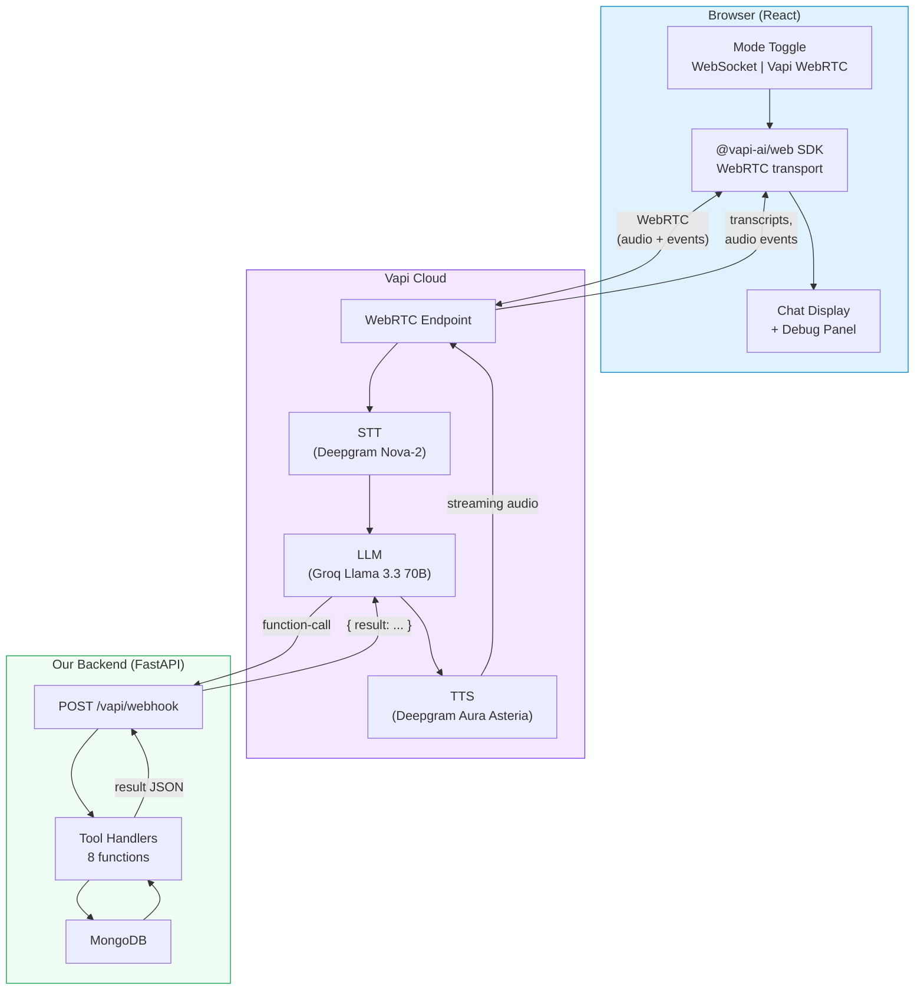
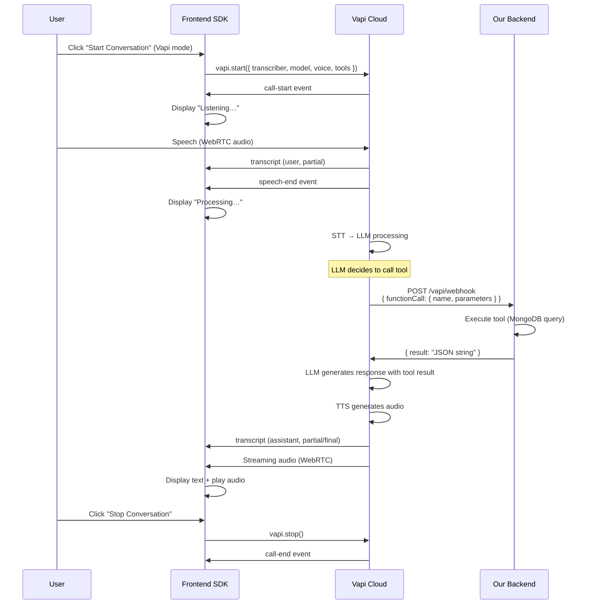

# Vapi WebRTC Integration

SmileCare supports a second transport mode — **Vapi WebRTC** — alongside the default WebSocket pipeline. Vapi provides a fully managed, low-latency voice AI platform that handles STT, LLM routing, and TTS in the cloud, communicating with the browser over WebRTC.

---

## Table of Contents

- [Architecture Overview](#architecture-overview)
- [How It Works](#how-it-works)
- [WebSocket vs Vapi: Comparison](#websocket-vs-vapi-comparison)
- [Configuration](#configuration)
- [Inline Assistant Config](#inline-assistant-config)
- [Webhook (Server URL)](#webhook-server-url)
- [Frontend Event Mapping](#frontend-event-mapping)
- [Latency Characteristics](#latency-characteristics)
- [Troubleshooting](#troubleshooting)

---

## Architecture Overview



### Data Flow Summary

1. **Browser** captures mic audio → sends over WebRTC to Vapi cloud
2. **Vapi** runs the full STT → LLM → TTS pipeline in their cloud
3. When the LLM triggers a tool call, Vapi sends a POST to our **webhook** (`/vapi/webhook`)
4. Our backend executes the tool against **MongoDB** and returns the result
5. Vapi feeds the result back into the LLM, generates TTS, and streams audio back via WebRTC
6. The **browser** receives transcripts and audio events from the SDK

---

## How It Works

### Mode Toggle

The frontend provides a toggle in the header (visible when no conversation is active):

- **WebSocket** (default): Custom pipeline — our backend handles STT, LLM, and TTS directly
- **Vapi WebRTC**: Fully managed pipeline — Vapi cloud handles everything, only tool calls hit our backend

### Vapi Call Lifecycle



---

## WebSocket vs Vapi: Comparison

| Feature | WebSocket Mode | Vapi WebRTC Mode |
|---------|---------------|-----------------|
| **Transport** | WebSocket (`ws://`) | WebRTC (peer-to-peer) |
| **STT** | Deepgram Nova-3 (our server) | Deepgram Nova-2 (Vapi cloud) |
| **LLM** | Groq Llama 3.3 70B (our server) | Groq Llama 3.3 70B (Vapi cloud) |
| **TTS** | Deepgram Aura (our server) | Deepgram Aura Asteria (Vapi cloud) |
| **VAD** | Client-side sliding-window | Vapi server-side |
| **Tool execution** | Direct (in-process) | Webhook (HTTP POST) |
| **Latency control** | Full (we control the pipeline) | Vapi-managed (lower overhead) |
| **Audio format** | PCM-16 LE → MP3 (base64 over WS) | WebRTC audio streams |
| **Barge-in** | Client-side VAD threshold ×2.5 | Vapi-managed |
| **Debug latency** | Per-stage server + client timing | Vapi end-of-call report |
| **API keys needed** | `GROQ_API_KEY`, `DEEPGRAM_API_KEY` | `VAPI_PUBLIC_KEY` (Vapi manages sub-keys) |
| **Cost** | Pay per API call to Groq + Deepgram | Vapi per-minute pricing (includes sub-services) |

---

## Configuration

### Backend

No backend configuration needed for Vapi mode beyond having the webhook registered (already done in `main.py`):

```python
app.include_router(vapi_webhook.router)
```

### Frontend

Set the Vapi public key in `frontend/.env`:

```env
VITE_VAPI_PUBLIC_KEY=your-vapi-public-key
```

Or in `frontend/.env.example`:

```env
VITE_API_BASE=http://localhost:8000
VITE_VAPI_PUBLIC_KEY=your-vapi-public-key
```

### Vapi Dashboard

In your Vapi dashboard, ensure:
1. You have a valid public key
2. The Groq and Deepgram provider credentials are configured (Vapi manages them for you)

---

## Inline Assistant Config

Instead of creating an assistant in the Vapi dashboard, SmileCare uses an **inline assistant configuration** passed directly to `vapi.start()`. This keeps the full config in our codebase:

```js
await vapi.start({
  transcriber: {
    provider: 'deepgram',
    model: 'nova-2',
    language: 'en',
  },
  model: {
    provider: 'groq',
    model: 'llama-3.3-70b-versatile',
    temperature: 0.7,
    messages: [{ role: 'system', content: '...' }],
    tools: [
      // 8 tools, each with server: { url: serverUrl }
    ],
  },
  voice: {
    provider: 'deepgram',
    voiceId: 'asteria',
  },
  name: 'SmileCare AI',
  firstMessage: 'Hello! Welcome to SmileCare Dental Clinic. How can I help you today?',
});
```

### Tools in Inline Config

Each tool definition includes a `server.url` pointing to our webhook:

```js
{
  type: 'function',
  function: {
    name: 'check_available_slots',
    description: 'Check available appointment time slots for a given date.',
    parameters: { type: 'object', properties: { date: { type: 'string' } }, required: ['date'] },
  },
  server: { url: `${API_BASE}/vapi/webhook` },
}
```

All 8 tools use the same webhook URL — the backend dispatches by function name.

---

## Webhook (Server URL)

**Endpoint:** `POST /vapi/webhook`  
**File:** `app/routers/vapi_webhook.py`

### Request Format

Vapi sends a JSON payload with a `message` object:

```json
{
  "message": {
    "type": "function-call",
    "functionCall": {
      "name": "check_available_slots",
      "parameters": { "date": "2026-03-06" }
    }
  }
}
```

### Response Format

The webhook returns a JSON object with the tool result:

```json
{
  "result": "{\"available_slots\": [\"09:00 AM\", \"09:30 AM\", ...]}"
}
```

### Supported Message Types

| Type | Action |
|------|--------|
| `function-call` | Execute tool, return result (with latency logging) |
| `assistant-request` | Return `{}` (no dynamic override) |
| `status-update` | Log status |
| `end-of-call-report` | Log call report (duration, cost) |

### Latency Logging

The webhook logs tool execution time:
```
[LATENCY][VAPI] function-call: check_available_slots({"date": "2026-03-06"})
[LATENCY][VAPI] check_available_slots completed in 12 ms (result: {"available_slots": ...})
```

---

## Frontend Event Mapping

The Vapi SDK emits events that map to UI state changes:

| Vapi Event | UI Action |
|------------|-----------|
| `call-start` | Set status "Listening…" |
| `call-end` | Reset all state, show "Conversation ended" |
| `speech-start` | `isSpeaking = true`, barge-in if TTS playing |
| `speech-end` | `isSpeaking = false`, `isProcessing = true` |
| `volume-level` | Update `rmsLevel` for audio ring indicator |
| `message.transcript` (user, partial) | Show italic partial transcript |
| `message.transcript` (user, final) | Commit user bubble to chat |
| `message.transcript` (assistant, partial) | Show assistant text, set TTS playing |
| `message.transcript` (assistant, final) | Commit assistant bubble to chat |
| `message.function-call` | Log tool call in debug panel |
| `message.end-of-call-report` | Log duration, cost, analysis |
| `error` | Flash error status for 3s, then resume |

### Key Refs

| Ref | Purpose |
|-----|---------|
| `vapiRef` | Vapi SDK instance |
| `vapiActiveRef` | Boolean — prevents stale closure issues |

---

## Latency Characteristics

### WebSocket Mode (Full Debug)

The WebSocket mode provides granular latency measurement:

- **Server-side:** Per-stage timing (STT, LLM first token, LLM total, TTS) with sub-stage breakdown (WAV conversion, API calls, chunk counts, audio bytes)
- **Client-side:** Round-trip timing (end_of_speech → final_transcript → first stream → TTS audio)
- **Debug panel:** Color-coded latency dashboard + client round-trip section

### Vapi Mode

Vapi manages the pipeline internally, so individual stage timings are not available. Instead:

- **end-of-call-report:** Provides total call duration and cost
- **Transcript events:** Can be used to measure perceived latency (speech-end → first assistant transcript)
- **Tool execution:** Our webhook logs per-tool execution time

---

## Troubleshooting

| Issue | Solution |
|-------|----------|
| "Error: VITE_VAPI_PUBLIC_KEY not set" | Add `VITE_VAPI_PUBLIC_KEY` to `frontend/.env` |
| Vapi call fails to start | Check Vapi dashboard for valid public key and provider credentials |
| Tools not executing | Ensure backend is running and accessible from Vapi cloud (use ngrok for local dev) |
| No audio from assistant | Check browser autoplay policy — user must interact first |
| Webhook returning errors | Check `[LATENCY][VAPI]` logs in backend terminal |
| High tool latency | Check MongoDB connection — tool execution is logged with timing |
