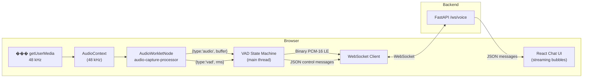
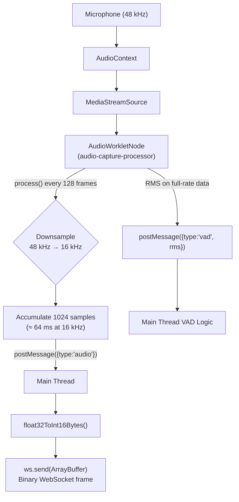
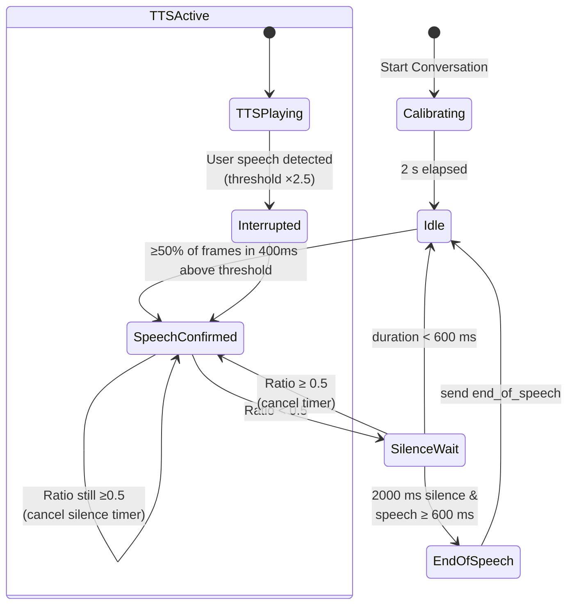
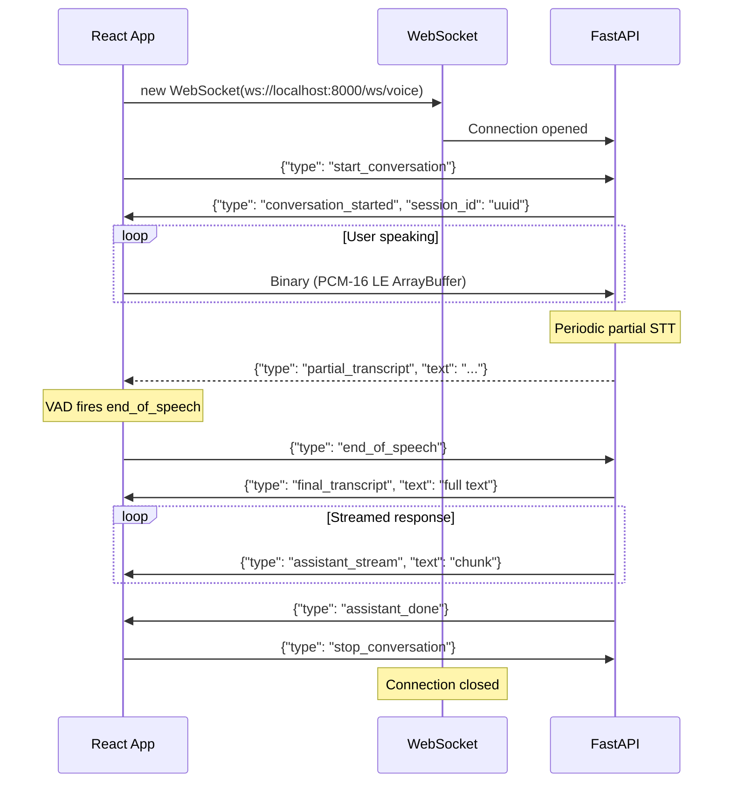

# SmileCare – Frontend

React 18 voice-first frontend for the SmileCare Dental Clinic AI assistant. Uses the **AudioWorklet API** for low-latency microphone capture, client-side **energy-based VAD** for automatic speech boundary detection, and a persistent **WebSocket** to stream audio and receive AI responses in real time.

---

## Table of Contents

- [Architecture](#architecture)
- [Audio Pipeline](#audio-pipeline)
- [VAD (Voice Activity Detection)](#vad-voice-activity-detection)
- [WebSocket Client Protocol](#websocket-client-protocol)
- [UI Components](#ui-components)
- [State Management](#state-management)
- [File Structure](#file-structure)
- [Development](#development)
- [Configuration](#configuration)

---

## Architecture



### Two-button Interface

The UI has only **two controls**: **Start Conversation** and **Stop Conversation**. There is no separate mic toggle, no text input, and no debug panel. Speech boundaries are detected automatically by the VAD.

---

## Audio Pipeline



### AudioWorklet Processor (`audio-processor.js`)

The worklet runs in a dedicated audio thread to avoid main-thread jank:

| Property | Value | Description |
|----------|-------|-------------|
| Target sample rate | 16 kHz | Downsampled from native rate via decimation |
| Chunk size | 1024 samples | ≈ 64 ms of audio per message |
| RMS computation | Every `process()` call | Computed on original full-rate samples |
| Decimation method | Simple skip (every Nth sample) | `ratio = round(sourceRate / targetRate)` |

The processor posts two message types to the main thread:
- `{type: 'audio', buffer: Float32Array}` — downsampled audio chunk
- `{type: 'vad', rms: number, peak: number}` — energy level + peak amplitude for voice activity detection

---

## VAD (Voice Activity Detection)

Client-side **sliding-window ratio-based VAD** runs entirely in the main thread using RMS + peak values from the AudioWorklet:



### Parameters

| Constant | Value | Purpose |
|----------|-------|---------|
| `CALIBRATION_DURATION_MS` | `2000` | Noise-floor calibration window |
| `NOISE_FLOOR_MULTIPLIER` | `6` | threshold = noise_floor × 6 |
| `MIN_ABSOLUTE_THRESHOLD` | `0.02` | Hard minimum RMS threshold |
| `SPEECH_WINDOW_MS` | `400` | Sliding window length for ratio check |
| `SPEECH_RATIO` | `0.5` | Minimum fraction of above-threshold frames |
| `VAD_SILENCE_TIMEOUT_MS` | `2000` | Milliseconds of silence to end turn |
| `VAD_SPEECH_MIN_MS` | `600` | Minimum speech duration |
| `MAX_CREST_FACTOR` | `10` | peak/RMS above this = impulsive noise |
| `RMS_SMOOTHING_ALPHA` | `0.35` | EMA smoothing (0=heavy, 1=raw) |
| `PRE_SPEECH_CHUNKS` | `15` | Ring buffer ≈ 3.8 s look-back |
| `TTS_INTERRUPT_MULTIPLIER` | `2.5` | Threshold multiplier during TTS |

### How it works

1. **Calibration** (2 s): AudioWorklet posts RMS values. Average = noise floor. Threshold = max(floor × 6, 0.02).
2. **Sliding window**: Each frame recorded as above/below threshold. Window trimmed to 400 ms.
3. **Confirmation**: If ≥50% of frames in window are above threshold → speech confirmed.
4. **Pre-speech buffer**: 15 audio chunks (≈3.8 s) are buffered before confirmation; flushed on confirm.
5. **Audio gating**: PCM only sent to backend when speech is confirmed.
6. **Crest factor**: Frames with peak/RMS > 10 are rejected (keyboard clicks, impacts).
7. **Silence**: 2 s below threshold → `end_of_speech`. If total < 600 ms → discarded.
8. **TTS barge-in**: During TTS playback, threshold ×2.5 to avoid echo. User speech still detected; stops playback.

### Hallucination Filtering

Both frontend and backend filter known Whisper hallucinations ("thank you for watching", "[Music]", filler words). Transcripts must be ≥2 words and ≥4 characters.

---

## WebSocket Client Protocol



### Message handling in `App.jsx`

| Server message | UI action |
|---------------|-----------|
| `conversation_started` | Store `session_id` |
| `partial_transcript` | Show italic user text with ▎ cursor |
| `final_transcript` | Commit user bubble to message list (with hallucination + length filter) |
| `assistant_stream` | Buffer silently (not shown until TTS) |
| `assistant_done` | Store full text, wait for TTS audio |
| `tts_audio` | Play MP3 + reveal words one-by-one, 🔊 icon in bubble |
| `tts_error` | Show full text immediately without audio |
| `error` | Flash error status for 3 s, then resume |

---

## UI Components

The entire frontend is a single `App.jsx` component with these visual sections:

### Header
- App title: **��� SmileCare AI**
- Status text (Connecting / Listening / Processing / Error)
- Start or Stop button (toggles based on `conversationActive`)

### Chat Area
- **User bubbles** (blue, right-aligned) — committed `final_transcript` messages
- **Partial transcript** (lighter blue, italic, right-aligned) — live interim STT
- **Assistant bubbles** (white with border, left-aligned) — committed responses
- **TTS bubble** (green border, left-aligned, 🔊 icon) — word-by-word reveal during TTS playback
- **Thinking indicator** — bouncing dots shown during processing before TTS starts
- Auto-scrolls to latest message

### Footer (visible during active conversation)
- **Audio level ring** — circular indicator that scales with RMS energy
- Dynamic icon: microphone (listening), speaker (TTS playing)
- Dynamic color: amber (calibrating), green (user speaking), violet (TTS playing), gray (idle)
- Status label: Calibrating / Listening / Speaking / Processing / Waiting for speech

### Debug Panel
- Collapsible panel at bottom-right (▲ Show Debug / ▼ Hide Debug)
- Timestamped, color-coded log entries (red for errors, green for confirmations)
- Shows VAD events, transcript decisions, TTS events
- Also logs to browser console with `[VAD-DBG]` prefix

---

## State Management

All state is managed with React hooks (`useState`, `useRef`, `useCallback`):

| State | Type | Purpose |
|-------|------|---------|
| `conversationActive` | `boolean` | Whether a session is in progress |
| `status` | `string` | Status bar text |
| `userText` | `string` | Live partial transcript |
| `assistantText` | `string` | Live word-by-word TTS text |
| `messages` | `{role, content}[]` | Committed chat history |
| `isSpeaking` | `boolean` | VAD detected active speech |
| `isProcessing` | `boolean` | Waiting for / receiving assistant response |
| `isTTSPlaying` | `boolean` | TTS audio is currently playing |
| `sessionId` | `string` | Current WebSocket session ID |
| `rmsLevel` | `number` | Current audio energy level |
| `isCalibrating` | `boolean` | Noise-floor calibration in progress |
| `debugLogs` | `string[]` | Debug panel log entries |
| `showDebug` | `boolean` | Debug panel visibility |

### Refs

| Ref | Purpose |
|-----|---------||
| `wsRef` | WebSocket instance |
| `audioCtxRef` | AudioContext instance |
| `workletNodeRef` | AudioWorkletNode |
| `streamRef` | MediaStream (for cleanup) |
| `silenceTimerRef` | VAD silence timeout ID |
| `speechStartRef` | Timestamp of speech onset |
| `hasSpeechRef` | Whether VAD has detected speech |
| `activeRef` | Non-stale active flag for closures |
| `assistantBuf` | Accumulates streamed assistant chunks |
| `chatEndRef` | Scroll-to-bottom anchor |
| `calibrationStartRef` | Calibration start timestamp |
| `calibrationSamples` | RMS samples during calibration |
| `noiseFloorRef` | Computed ambient noise floor |
| `speechThresholdRef` | Dynamic speech threshold |
| `speechConfirmedRef` | True when speech gate passed |
| `vadFrameHistory` | Sliding window of {ts, above} entries |
| `smoothedRmsRef` | EMA-smoothed RMS value |
| `preSpeechBufRef` | Pre-speech audio ring buffer |
| `ttsAudioRef` | HTMLAudioElement for TTS playback |
| `ttsTextRef` | Full assistant text during TTS |
| `wordTimerRef` | setInterval ID for word reveal |
| `ttsBlobUrlRef` | Object URL for TTS audio blob |

---

## File Structure

```
frontend/
├── index.html               # Root HTML (mounts #root)
├── package.json              # React 18, Vite, Tailwind CSS 4
├── vite.config.js            # Vite config with React + Tailwind plugins
├── public/
│   └── audio-processor.js    # AudioWorklet processor (16 kHz + RMS + peak)
└── src/
    ├── main.jsx              # React root render
    ├── App.jsx               # Voice UI: VAD, TTS playback, barge-in, debug panel
    └── index.css             # Tailwind CSS imports
```

---

## Development

### Prerequisites

- Node.js 18+
- Backend running at `http://localhost:8000`

### Install & run

```bash
cd frontend
npm install
npm run dev
```

Opens at `http://localhost:5173`. The Vite dev server proxies nothing — the React app connects directly to the FastAPI backend via WebSocket (`ws://localhost:8000/ws/voice`).

### Build for production

```bash
npm run build
npm run preview
```

---

## Configuration

| Variable | Default | Description |
|----------|---------|-------------|
| `VITE_API_BASE` | `http://localhost:8000` | Backend URL (auto-derives WS URL) |

Set via `.env` in the `frontend/` directory:

```env
VITE_API_BASE=http://localhost:8000
```

The WebSocket URL is derived automatically by replacing `http` with `ws`:

```js
const API_BASE = import.meta.env.VITE_API_BASE || 'http://localhost:8000';
const WS_BASE  = API_BASE.replace(/^http/i, 'ws');
```

---

## Dependencies

| Package | Version | Purpose |
|---------|---------|---------|
| `react` | ^18.3.1 | UI framework |
| `react-dom` | ^18.3.1 | React DOM renderer |
| `tailwindcss` | ^4.2.1 | Utility-first CSS |
| `@tailwindcss/vite` | ^4.2.1 | Tailwind Vite integration |
| `lucide-react` | ^0.576.0 | Icon library |
| `vite` | ^5.4.19 | Build tool |
| `@vitejs/plugin-react` | ^4.6.0 | React fast refresh |
