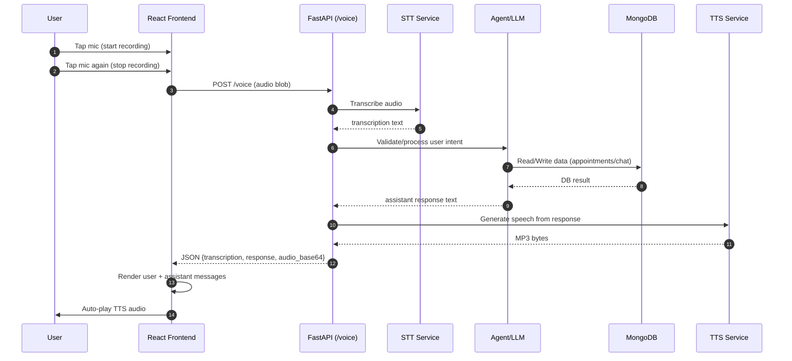
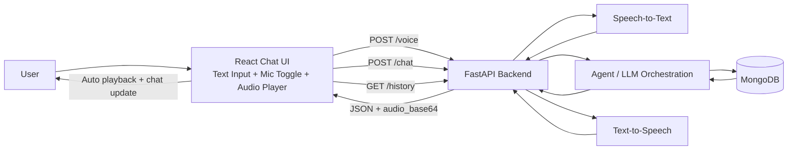

# Frontend (React + Vite + Tailwind)

Real-time voice assistant frontend using WebSocket for persistent, reliable voice interaction with the clinic booking system.

## Features

- **Chat interface** with message history (loaded and persisted)
- **Conversation Lifecycle Control** - explicit Start/Stop buttons for session management
- **Real-time WebSocket voice** - persistent connection across multiple recordings within one conversation
- **Bottom text composer** with send button for typing messages
- **Mic toggle button** - tap to start recording, tap again to stop and process
- **Auto playback** of TTS audio responses
- **WebSocket debug panel** - live socket state, chunk counters, and event timeline
- **Smart Auto-reconnection** - reconnects only when conversation is active
- **Loading indicators** while backend processes requests

---

## Conversation Lifecycle

### Session Control

The new implementation gives users explicit control over conversation sessions using Start/Stop buttons in the header:

**Before (Always Connected):**
- WebSocket opened on page load
- Auto-reconnected after any disconnect
- No clear session boundaries
- Difficult to understand when socket was active

**After (Explicit Sessions):**
- Page loads with no connection
- Click "Start Conversation" to open session
- Click "Stop Conversation" to close session cleanly
- Clear visual feedback (green button = start, red button = stop)

### State Diagram

```
Page Load
    ↓
┌─ No Connection ─────────────────────────────┐
│ ✓ Mic button disabled                       │
│ ✓ Text input disabled                       │
│ ✓ "Start Conversation" button (green)       │
│ Status: "Conversation ended..."             │
└─────────────────────────────────────────────┘
         ↓                                ↑
    Click Start              Click Stop   │
         ↓                      ↑         │
    [Connecting]               │         │
         ↓                      │         │
┌─ Active Conversation ──────────┤─┐
│ ✓ WebSocket open              │ │
│ ✓ Mic button enabled          │ │
│ ✓ Text input enabled          │ │
│ ✓ "Stop Conversation" (red)   │ │
│ ✓ Chat updates               │ │
│ ✓ Auto-reconnect if dropped  │ │
└──────────────────────────────┘ │
         │                       │
    (Multiple Turns)             │
    • Voice recording            │
    • Text chat                  │
    • Interleaved responses      │
         │                       │
         └───────────────────────┘
```

### Multiple Turns Within One Conversation

Once a conversation is started, you can:
1. Record unlimited voice messages
2. Send unlimited text messages
3. Interleave voice and text
4. WebSocket persists across all turns
5. No reconnections between turns
6. Chat history accumulates

```
Start Conversation
    ↓
Turn 1: Voice + Response
    ↓
Turn 2: Text + Response
    ↓
Turn 3: Voice + Response
    ↓
Turn 4: Voice + Response
    ↓
(WebSocket stays open the entire time)
```

### Error Recovery

**Internet Disconnect:**
- Frontend detects WebSocket close
- Automatically attempts to reconnect every 2 seconds
- Reconnects successfully when internet returns
- **Conversation remains active** throughout
- User can continue using mic immediately after reconnect

**Backend Server Down:**
- WebSocket close triggers reconnect loop
- Frontend keeps trying every 2 seconds
- When server restarts, next reconnect succeeds
- **Conversation stays active** if not manually stopped

**Browser Refresh:**
- Conversation stops (by design)
- Chat history loads from backend
- Must click "Start Conversation" to begin new session
- Prevents accidental double-session

---

- Node.js 18+
- Backend running at `http://localhost:8000` (default)

## Setup & Run

```bash
npm install
npm run dev
```

App runs on `http://localhost:5173`

### Optional Environment Variable

Create `.env` file in `frontend/` if backend URL differs:

```bash
VITE_API_BASE=http://localhost:8000
```

---

## Architecture

### WebSocket Real-Time Voice Flow

**Problem We Solved:**
The original implementation streamed audio chunks individually, which caused issues:
1. Concatenating raw webm chunks corrupts the container format
2. Groq API rejected corrupted audio: "Error code: 400 - could not process file"
3. Exception handling outside the loop caused connection to close after one request
4. Mic button became disabled after first interaction

**Solution:**
Frontend now collects all audio chunks in memory, combines them into a single complete webm Blob, and sends the complete audio in one message.

### Recording & Submission Flow

```
User taps mic
    ↓
startRecording()
    ├─ Request microphone access
    ├─ Create MediaRecorder
    ├─ Initialize empty recordedChunks array
    └─ Start recording (1500ms intervals)
    ↓
Recording continues...
    ├─ ondataavailable fires every 1500ms
    ├─ Append Blob chunks to recordedChunks
    └─ UI shows "Recording... tap mic again to send"
    ↓
User taps mic again
    ↓
stopRecording()
    ├─ Stop MediaRecorder
    ├─ Close microphone stream
    ├─ Combine all Blobs into single webm Blob
    ├─ blobToBase64() encodes complete audio
    └─ Send audio_data message to WebSocket
    ↓
Backend processes
    ├─ STT (Groq Whisper)
    ├─ Agent processing
    └─ TTS (ElevenLabs)
    ↓
Receive response events
    ├─ transcription → add user message
    ├─ agent_text → add assistant message
    └─ audio_ready → play response audio
    ↓
Ready for next recording ✓
```

### WebSocket Message Contract

**Frontend sends (complete audio):**
```json
{
  "type": "audio_data",
  "data": "base64-encoded-webm-blob"
}
```

**Backend responds with sequence of events:**

1. **User speech transcribed**
```json
{
  "type": "transcription",
  "text": "what user said"
}
```

2. **Assistant response generated**
```json
{
  "type": "agent_text",
  "text": "what assistant replies"
}
```

3. **Audio ready to play**
```json
{
  "type": "audio_ready",
  "audio_url": "/audio/response_<uuid>.mp3"
}
```

4. **If error occurs**
```json
{
  "type": "error",
  "message": "descriptive error message"
}
```

### Key Components

**State Management:**
- `messages` - chat history array
- `isRecording` - recording in progress
- `isLoading` - backend processing
- `isWsConnected` - WebSocket connection status
- `socketState` - 'connecting', 'open', 'closed', 'error'
- `chunkSentCount` / `chunkAckCount` - recording debug info
- `wsTimeline` - recent WebSocket events (last 6)

**Key Functions:**
- `connectWebSocket()` - establishes persistent WS connection with auto-reconnect
- `startRecording()` - begins audio capture
- `stopRecording()` - stops capture, combines chunks, sends to backend
- `trackWsEvent()` - logs WebSocket events to debug panel
- `playAudioFromBase64()` - plays base64-encoded audio from text chat

### Debug Panel

Located below the chat area, shows in real-time:
- **Socket**: Current connection state
- **Chunks sent**: Audio chunks collected during recording
- **Chunks acked**: Not used in new implementation (kept for compatibility)
- **Last event**: Most recent WebSocket message type
- **Timeline**: Last 6 events (socket_open, recording_started, audio_sent, transcription, etc.)

This helps troubleshoot voice issues without console access.

---

## API Integration

### WebSocket Endpoint

```
ws://localhost:8000/ws/voice
```

**Established on component mount**, persists across multiple recordings.

**Auto-reconnects** with 2-second delay if closed.

### REST Endpoints Used

**Text chat:**
```
POST /chat
Request: { "message": "user text" }
Response: { "response": "assistant text", "audio_base64": "...", "audio_mime_type": "audio/mpeg" }
```

**Chat history:**
```
GET /history
Response: { "messages": [ { "role": "user|assistant", "content": "...", "created_at": "..." }, ... ] }
```

---

## Browser Compatibility

| Feature | Chrome | Firefox | Safari | Edge |
|---------|--------|---------|--------|------|
| MediaRecorder | ✓ | ✓ | ✓ | ✓ |
| WebSocket | ✓ | ✓ | ✓ | ✓ |
| getUserMedia | ✓ | ✓ | ✓ | ✓ |
| Base64 encoding | ✓ | ✓ | ✓ | ✓ |

---

## Troubleshooting

### Mic button disabled
- Check browser console for errors
- Verify backend is running and reachable
- Check WebSocket debug panel - socket should show 'open'

### "Voice socket disconnected" message
- Backend may have crashed - restart `uvicorn app.main:app --reload`
- Frontend will auto-reconnect in 2 seconds

### No audio response
- Check that ElevenLabs API key is set in backend .env
- Verify audio player isn't muted
- Check browser console for playback errors

### Transcription fails
- Ensure Groq API key is set in backend .env
- Check audio quality - speak clearly into microphone
- Verify webm file is being sent correctly (check network tab)

---

## Files

- `src/App.jsx` - Main component with WebSocket & recording logic
- `src/main.jsx` - Entry point
- `src/index.css` - Global styles
- `vite.config.js` - Vite configuration
- `.env` - Optional environment variablesFrontend behavior:
- Appends `transcription` as user chat message
- Appends `response` as assistant chat message
- Decodes `audio_base64` and auto-plays TTS

### `POST /chat`
Request JSON:

```json
{ "message": "text input" }
```

Response JSON:

```json
{
  "response": "assistant text",
  "audio_base64": "<base64-mp3>",
  "audio_mime_type": "audio/mpeg"
}
```

Frontend behavior:
- Appends text messages to chat
- Auto-plays returned TTS audio

### `GET /history`
Loads prior chat messages for the panel.

## Complete Architecture Workflow

### End-to-End Voice Flow



### System Architecture (Components)


