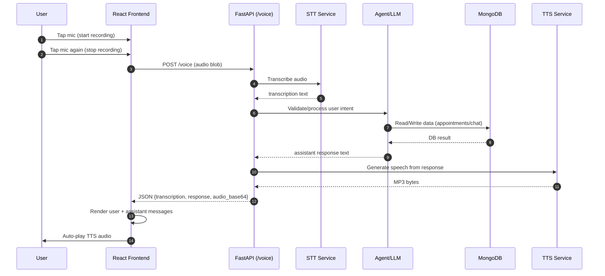
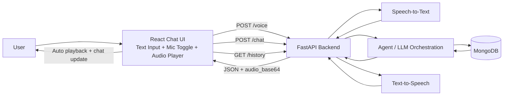

# Frontend (React + Vite + Tailwind)

Chat-style voice assistant frontend for the clinic app.

## Features

- Chat interface with message history
- Bottom text composer with send button
- Mic toggle button (tap to start recording, tap again to stop/send)
- Auto playback of TTS audio returned by backend
- Loading indicator while backend processes requests

## Prerequisites

- Node.js 18+
- Backend running at `http://localhost:8000` (default)

## Run

```bash
npm install
npm run dev
```

App runs on `http://localhost:5173`.

## Optional Environment Variable

Create a `.env` file in `frontend/` if backend URL differs:

```bash
VITE_API_BASE=http://localhost:8000
```

## API Contract Used by Frontend

### `POST /voice`
Request: `multipart/form-data` with `file` audio blob.

Response JSON:

```json
{
  "transcription": "user speech text",
  "response": "assistant text",
  "audio_base64": "<base64-mp3>",
  "audio_mime_type": "audio/mpeg"
}
```

Frontend behavior:
- Appends `transcription` as user chat message
- Appends `response` as assistant chat message
- Decodes `audio_base64` and auto-plays TTS

### `POST /chat`
Request JSON:

```json
{ "message": "text input" }
```

Response JSON:

```json
{
  "response": "assistant text",
  "audio_base64": "<base64-mp3>",
  "audio_mime_type": "audio/mpeg"
}
```

Frontend behavior:
- Appends text messages to chat
- Auto-plays returned TTS audio

### `GET /history`
Loads prior chat messages for the panel.

## Complete Architecture Workflow

### End-to-End Voice Flow



### System Architecture (Components)


